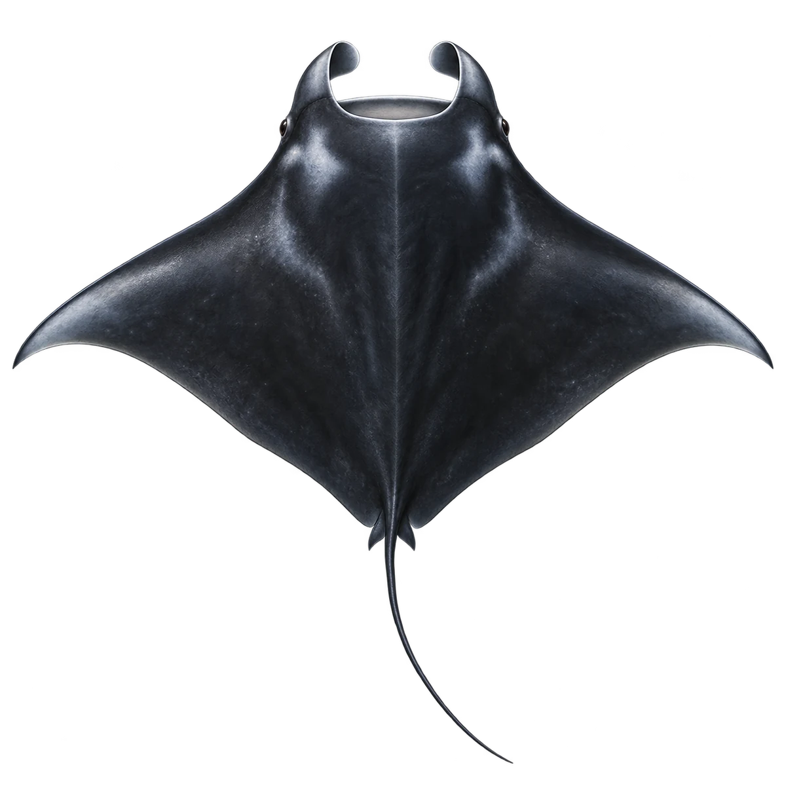

# 巨型蝠鲼 · 内容包 v1

2026-10-06 · Mobula birostris · 主要制作：主代理亲自完成。

## 观察与自由创作

孩子入口：这是巨型蝠鲼，它也是一种鱼。

试试大翅膀一样的鳍，再自由设计头前的两片小叶子。

| 点听 | 短句 | 事实依据 |
| --- | --- | --- |
| 像翅膀的鳍 | 大大的胸鳍，像一对翅膀。 | MB-01 |
| 头前的小叶片 | 嘴巴前面，有两片小小的头鳍。 | MB-02 |
| 过滤小食物 | 它会从水里，过滤浮游小动物。 | MB-03 |

不是答题关卡。创作不要求与真实鱼一致；不同嘴、鳍、身体和花纹可以自由组合。

## 亲子解释与证据范围

采用背面稍斜的宽幅黑背示意，区别于侧视硬骨鱼；没有腹面斑点图供个体辨识。蝠鲼用于观察、入海与创作灵感，当前不进入普通钓鱼池。

本页事实引用 [claims.json](../claims.json)：MB-01、MB-02、MB-03。

- [NOAA Fisheries：Giant Manta Ray](https://www.fisheries.noaa.gov/species/giant-manta-ray)

中文短名是孩子入口称呼，正式中文名为项目称呼或工作名；以学名明确对象，未统一认证所有地区俗名。艺术图不是照片，也不是精细分类检索图。

## 已制作素材

- [PNG 原始插画](../../../design/content/v1/illustrations/mobula-birostris.png)
- [WebP 透明展示图](../../../public/content/v1/illustrations/mobula-birostris.webp)
- [短介绍音频](../../../public/content/v1/audio/vo-mb-intro.wav)；另有 3 段点听音频，见 [脚本登记](../scripts/audio-v1.json)。
- [互动预览](../../../public/content/v1/index.html) 包含局部编号、重听、停止和亲子来源展开。

成品用于素材评审和接入准备。声音为系统合成试听，正式分发的声音授权单列；鱼的真实泳姿、精细三维结构和原目录全部历史行为仍不因插画完成而自动认证。
