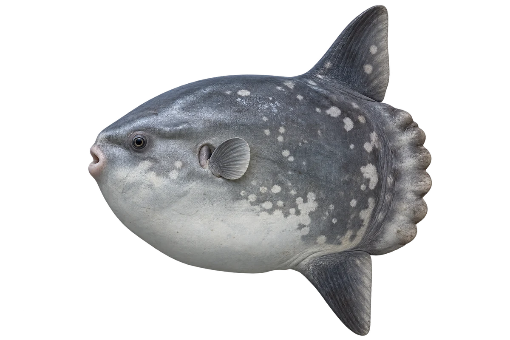

# 翻车鱼

Mola mola · 鱼 · 2026-10-07

以明确物种代表常用名称；插画是观察示意，不用来野外鉴定。

- **圆圆的大身体**：它身体大而圆，嘴相比之下很小。（VTH-BU-01）
- **特别的身体后缘**：它没有通常那样的尾鳍，身体后方是特殊的舵状结构。（VTH-BU-02）
- **用上下鳍游**：它摆动背鳍和臀鳍，在水中前进。（VTH-BU-03）

资料：[Australian Museum](https://australian.museum/learn/animals/fishes/ocean-sunfish-mola-mola/)。位置：Identification / Summary / Biology / Habitat / species account。

[事实表](../claims.json) · [配音脚本](../scripts/audio-v1.json) · [生成提示与原图索引](../../../design/content/v1/generation.json)

每卡一段介绍、三个点听。新卡没有设置未经标定的局部放大坐标。图为 AI 原创艺术示意，非鉴定照片；交付为 2D 插画及图鉴内容，不代表新增三维捕获物种。
