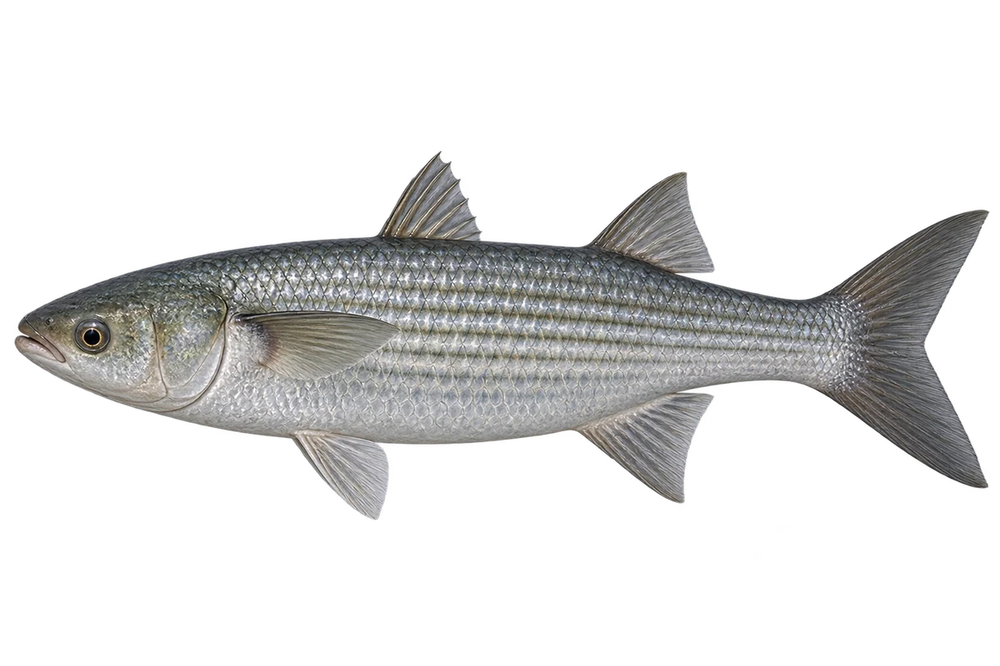

# 鲻鱼

Mugil cephalus · 鱼 · 2026-10-07

以明确物种代表常用名称；插画是观察示意，不用来野外鉴定。 本名包含隐存物种复合群，卡片不作全球统一物种鉴定。

- **平平的小头**：它身体细长，头的上面宽而平，嘴较小。（VTH-AY-01）
- **海岸和河口**：它会在海岸、河口和河流下段活动。（VTH-AY-02）
- **寻找藻和碎屑**：成鱼常在底部寻找藻类和有机碎屑。（VTH-AY-03）

资料：[Museums Victoria / Fishes of Australia](https://fishesofaustralia.net.au/home/species/3880)。位置：Identification / Summary / Biology / Habitat / species account。

[事实表](../claims.json) · [配音脚本](../scripts/audio-v1.json) · [生成提示与原图索引](../../../design/content/v1/generation.json)

每卡一段介绍、三个点听。新卡没有设置未经标定的局部放大坐标。图为 AI 原创艺术示意，非鉴定照片；交付为 2D 插画及图鉴内容，不代表新增三维捕获物种。
