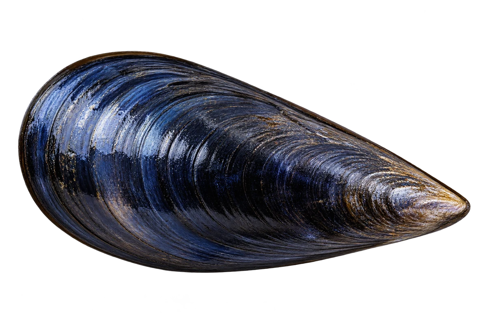

# 紫贻贝（蓝贻贝）

Mytilus edulis · 双壳贝 · 2026-10-07

中文食材俗名仅作生活联系；本卡以明确学名表示活体，不作为野外采集、鉴定或可食判断。

- **水滴一样的壳**：两片壳的轮廓，有些像长长的水滴。（VTH-DC-01）
- **深色的壳**：壳可以是蓝黑色、黑色或褐色。（VTH-DC-02）
- **用丝固定**：它用一束细丝，把自己固定在物体上。（VTH-DC-03）

资料：[NOAA Fisheries](https://www.fisheries.noaa.gov/species/blue-mussel)。位置：Appearance。

[事实表](../claims.json) · [配音脚本](../scripts/audio-v1.json) · [生成提示与原图索引](../../../design/content/v1/generation.json)

每卡一段介绍、三个点听。新卡没有设置未经标定的局部放大坐标。图为 AI 原创艺术示意，非鉴定照片；交付为 2D 插画及图鉴内容，不代表新增三维捕获物种。
