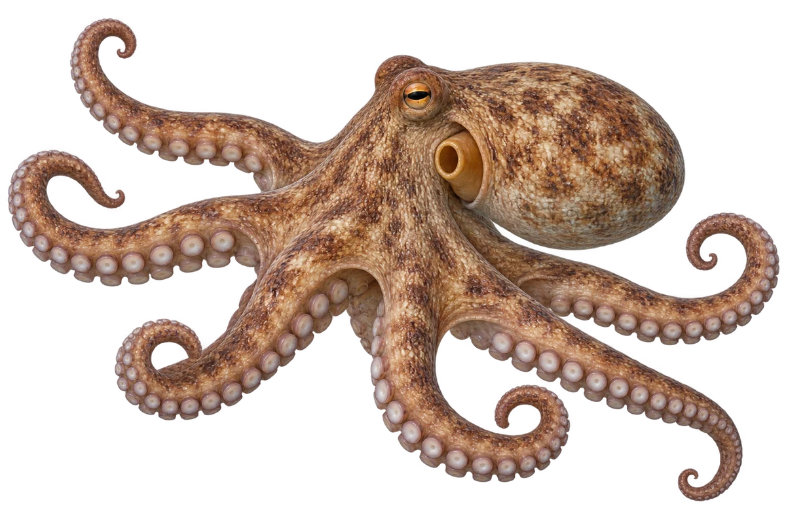

# 普通章鱼

Octopus vulgaris · 鱿鱼与章鱼 · 2026-10-07

中文食材俗名仅作生活联系；本卡以明确学名表示活体，不作为野外采集、鉴定或可食判断。 普通章鱼存在物种复合群；不把旧资料的广域分布全部作为本种已证实分布。

- **八条腕**：章鱼有八条腕，没有鱿鱼那两条长触腕。（VTH-CS-01）
- **两排吸盘**：每条腕上，能看到两排吸盘。（VTH-CS-02）
- **颜色会变化**：身体颜色可以变化，不是一直保持一种颜色。（VTH-CS-03）

资料：[Marine Biological Association / MarLIN](https://www.marlin.ac.uk/species/detail/1117)、[Monterey Bay Aquarium](https://www.montereybayaquarium.org/animals-the-ocean/animals-a-to-z/cephalopods)。位置：Description / identifying features。

[事实表](../claims.json) · [配音脚本](../scripts/audio-v1.json) · [生成提示与原图索引](../../../design/content/v1/generation.json)

每卡一段介绍、三个点听。新卡没有设置未经标定的局部放大坐标。图为 AI 原创艺术示意，非鉴定照片；交付为 2D 插画及图鉴内容，不代表新增三维捕获物种。
