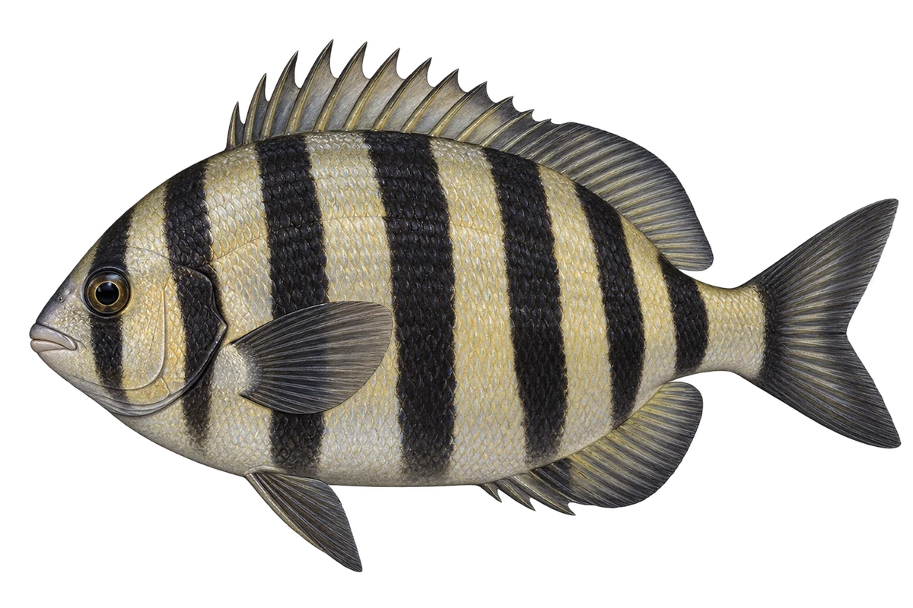

# 条石鲷 · 内容包 v1

2026-10-06 · Oplegnathus fasciatus · 主要制作：主代理亲自完成。

## 观察与自由创作

孩子入口：看看这条鱼，有好多黑色带子。

画宽带子、细带子，或者把它们变成彩虹色。

| 点听 | 短句 | 事实依据 |
| --- | --- | --- |
| 七条黑带 | 这些黑带里，有一条穿过眼睛。 | OF-01 |
| 像喙的嘴 | 它的牙齿连在一起，形成了像喙的嘴。 | OF-02 |
| 小鱼与海藻 | 小鱼会跟着漂浮的海藻活动。 | OF-03 |

不是答题关卡。创作不要求与真实鱼一致；不同嘴、鳍、身体和花纹可以自由组合。

## 亲子解释与证据范围

示意带纹明显的个体；七条包括眼部的一条，不要求儿童完成数数题。嘴是齿愈合形成的喙状结构。

本页事实引用 [claims.json](../claims.json)：OF-01、OF-02、OF-03。

- [中央研究院生物多樣性研究中心／臺灣魚類資料庫：Oplegnathus fasciatus](https://catalog.digitalarchives.tw/item/00/42/6c/9f.html)

中文短名是孩子入口称呼，正式中文名为项目称呼或工作名；以学名明确对象，未统一认证所有地区俗名。艺术图不是照片，也不是精细分类检索图。

## 已制作素材

- [PNG 原始插画](../../../design/content/v1/illustrations/oplegnathus-fasciatus.png)
- [WebP 透明展示图](../../../public/content/v1/illustrations/oplegnathus-fasciatus.webp)
- [短介绍音频](../../../public/content/v1/audio/vo-of-intro.wav)；另有 3 段点听音频，见 [脚本登记](../scripts/audio-v1.json)。
- [互动预览](../../../public/content/v1/index.html) 包含局部编号、重听、停止和亲子来源展开。

成品用于素材评审和接入准备。声音为系统合成试听，正式分发的声音授权单列；鱼的真实泳姿、精细三维结构和原目录全部历史行为仍不因插画完成而自动认证。
