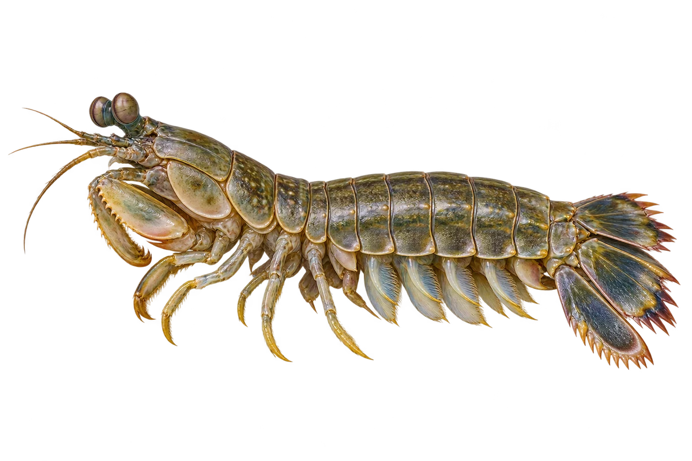

# 口虾蛄（皮皮虾）

Oratosquilla oratoria · 虾与龙虾 · 2026-10-07

中文食材俗名仅作生活联系；本卡以明确学名表示活体，不作为野外采集、鉴定或可食判断。 虾蛄属于口足目，和十足目的对虾不同；类别按钮是儿童浏览分组。

- **分节的身体**：身体一节一节的，尾端有宽宽的尾扇。（VTH-CD-01）
- **捕捉食物的脚**：前面的捕食脚可以折起来，上面有尖齿。（VTH-CD-02）
- **名字叫虾蛄**：虽然名字里有虾，它属于虾蛄这一类。（VTH-CD-03）

资料：[FAO 联合国粮农组织](https://www.fao.org/4/w7192e/w7192e12.pdf)。位置：Stomatopoda introduction / Squillidae / Oratosquilla key。

[事实表](../claims.json) · [配音脚本](../scripts/audio-v1.json) · [生成提示与原图索引](../../../design/content/v1/generation.json)

每卡一段介绍、三个点听。新卡没有设置未经标定的局部放大坐标。图为 AI 原创艺术示意，非鉴定照片；交付为 2D 插画及图鉴内容，不代表新增三维捕获物种。
