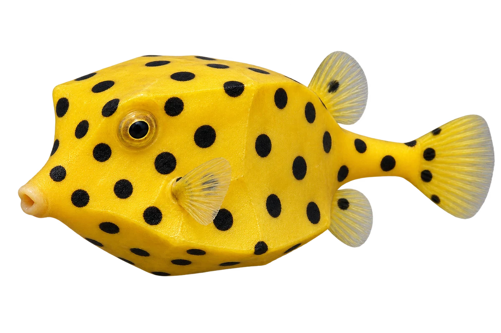

# 黄箱鲀 · 内容包 v1

2026-10-06 · Ostracion cubicus · 主要制作：主代理亲自完成。

## 观察与自由创作

孩子入口：这是黄箱鲀，像个黄色小盒子。

你的鱼可以是盒子形，也可以试试圆球形。

| 点听 | 短句 | 事实依据 |
| --- | --- | --- |
| 盒子身体 | 身体像一个小盒子。 | OC-01 |
| 黄衣黑点 | 黄色衣服上，有黑色圆点。 | OC-02 |
| 长大变化 | 长大以后，颜色和点点会变化。 | OC-03 |

不是答题关卡。创作不要求与真实鱼一致；不同嘴、鳍、身体和花纹可以自由组合。

## 亲子解释与证据范围

本图选幼鱼亮黄黑点色型。箱鲀不是充气后的河鲀，没有加入角箱鲀的额角；成长变化不以当前一张图证明。

本页事实引用 [claims.json](../claims.json)：OC-01、OC-02、OC-03。

- [Australian Museum：Yellow Boxfish](https://australian.museum/learn/animals/fishes/yellow-boxfish-ostracion-cubicus/)

中文短名是孩子入口称呼，正式中文名为项目称呼或工作名；以学名明确对象，未统一认证所有地区俗名。艺术图不是照片，也不是精细分类检索图。

## 已制作素材

- [PNG 原始插画](../../../design/content/v1/illustrations/ostracion-cubicus.png)
- [WebP 透明展示图](../../../public/content/v1/illustrations/ostracion-cubicus.webp)
- [短介绍音频](../../../public/content/v1/audio/vo-oc-intro.wav)；另有 3 段点听音频，见 [脚本登记](../scripts/audio-v1.json)。
- [互动预览](../../../public/content/v1/index.html) 包含局部编号、重听、停止和亲子来源展开。

成品用于素材评审和接入准备。声音为系统合成试听，正式分发的声音授权单列；鱼的真实泳姿、精细三维结构和原目录全部历史行为仍不因插画完成而自动认证。
