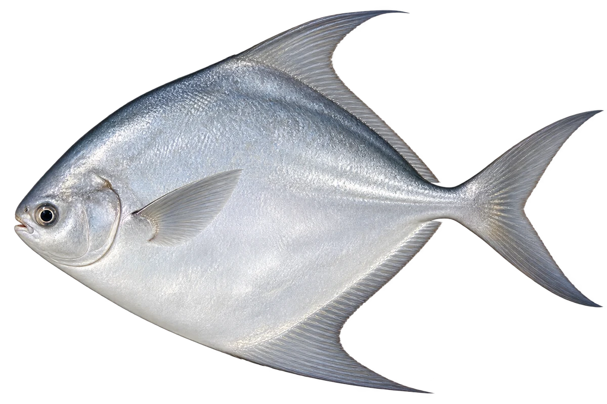

# 银鲳

Pampus argenteus · 鱼 · 2026-10-07

以明确物种代表常用名称；插画是观察示意，不用来野外鉴定。

- **银色扁身体**：银鲳身体很扁，肚子银白，嘴较小。（VTH-AZ-01）
- **没有腹鳍**：成鱼没有通常长在肚子下面的腹鳍。（VTH-AZ-02）
- **吃什么**：它会吃水母和浮游动物。（VTH-AZ-03）

资料：[中央研究院／臺灣魚類資料庫](https://fishdb.sinica.edu.tw/taxon/382652-fishdb)。位置：Identification / Summary / Biology / Habitat / species account。

[事实表](../claims.json) · [配音脚本](../scripts/audio-v1.json) · [生成提示与原图索引](../../../design/content/v1/generation.json)

每卡一段介绍、三个点听。新卡没有设置未经标定的局部放大坐标。图为 AI 原创艺术示意，非鉴定照片；交付为 2D 插画及图鉴内容，不代表新增三维捕获物种。
