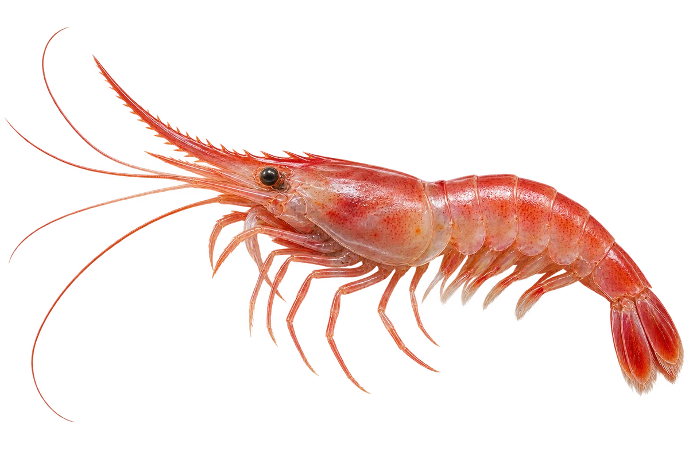

# 北方长额虾（北极甜虾）

Pandalus borealis · 虾与龙虾 · 2026-10-07

中文食材俗名仅作生活联系；本卡以明确学名表示活体，不作为野外采集、鉴定或可食判断。

- **活着也红红的**：它活着的时候就可以带红色，身体有些透明。（VTH-CC-01）
- **腹下的小桨**：腹部下面有小小的游泳脚，像一排小桨。（VTH-CC-02）
- **腹下带着卵**：虾妈妈会把卵带在腹部下面。（VTH-CC-03）

资料：[NOAA Fisheries](https://www.fisheries.noaa.gov/species/atlantic-northern-shrimp)。位置：Appearance / Habitat / Biology。

[事实表](../claims.json) · [配音脚本](../scripts/audio-v1.json) · [生成提示与原图索引](../../../design/content/v1/generation.json)

每卡一段介绍、三个点听。新卡没有设置未经标定的局部放大坐标。图为 AI 原创艺术示意，非鉴定照片；交付为 2D 插画及图鉴内容，不代表新增三维捕获物种。
