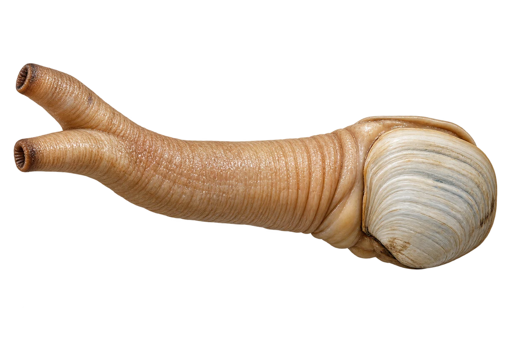

# 象拔蚌

Panopea generosa · 双壳贝 · 2026-10-07

中文食材俗名仅作生活联系；本卡以明确学名表示活体，不作为野外采集、鉴定或可食判断。

- **长长的水管**：两片壳外面，伸着长长的水管。（VTH-DH-01）
- **进水和出水**：水管有进水和出水的两个开口。（VTH-DH-02）
- **埋在海底**：身体可以埋在海底泥沙里。（VTH-DH-03）

资料：[NOAA Fisheries](https://www.fisheries.noaa.gov/species/geoduck)。位置：Appearance / habitat / biology。

[事实表](../claims.json) · [配音脚本](../scripts/audio-v1.json) · [生成提示与原图索引](../../../design/content/v1/generation.json)

每卡一段介绍、三个点听。新卡没有设置未经标定的局部放大坐标。图为 AI 原创艺术示意，非鉴定照片；交付为 2D 插画及图鉴内容，不代表新增三维捕获物种。
