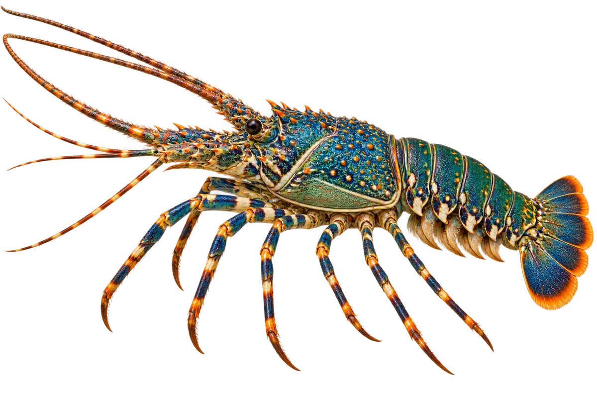

# 锦绣龙虾

Panulirus ornatus · 虾与龙虾 · 2026-10-07

中文食材俗名仅作生活联系；本卡以明确学名表示活体，不作为野外采集、鉴定或可食判断。

- **长长的触角**：头前有一对长长的触角。（VTH-CE-01）
- **没有大螯**：它不像螯龙虾那样，长着一对大钳子。（VTH-CE-02）
- **浅海的家**：可以生活在浅海的岩石和珊瑚附近。（VTH-CE-03）

资料：[FAO 联合国粮农组织](https://www.fao.org/docrep/pdf/009/t0411e/t0411e23.pdf)。位置：Panulirus ornatus / diagnostic diagram / Habitat。

[事实表](../claims.json) · [配音脚本](../scripts/audio-v1.json) · [生成提示与原图索引](../../../design/content/v1/generation.json)

每卡一段介绍、三个点听。新卡没有设置未经标定的局部放大坐标。图为 AI 原创艺术示意，非鉴定照片；交付为 2D 插画及图鉴内容，不代表新增三维捕获物种。
