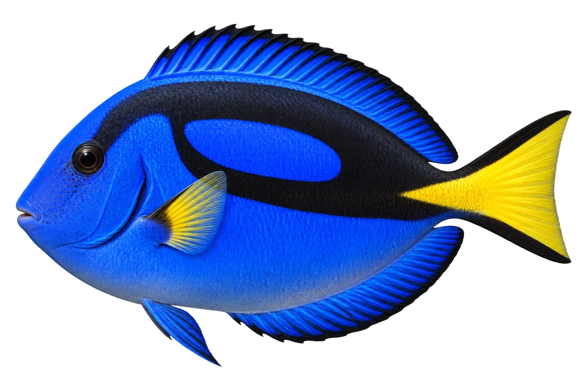

# 黄尾副刺尾鱼 · 内容包 v1

2026-10-06 · Paracanthurus hepatus · 主要制作：主代理亲自完成。

## 观察与自由创作

孩子入口：看看这条蓝色的鱼，还有黑色图案。

给你的鱼选两种很不一样的颜色，再加一块大图案。

| 点听 | 短句 | 事实依据 |
| --- | --- | --- |
| 蓝与黑 | 蓝色的身体上，有黑色图案。 | PH-01 |
| 黄色尾巴 | 尾巴是黄色的，上下边缘有黑色。 | PH-02 |
| 小小的食物 | 它主要吃水里的浮游小动物。 | PH-03 |

不是答题关卡。创作不要求与真实鱼一致；不同嘴、鳍、身体和花纹可以自由组合。

## 亲子解释与证据范围

观察身体、尾鳍和食物；不把所有刺尾鱼都当作吃藻类。这里没有把尾柄刀片与有毒鳍刺混为同一个结构。

本页事实引用 [claims.json](../claims.json)：PH-01、PH-02、PH-03。

- [Australian Museum / Mark McGrouther：Blue Tang](https://australian.museum/learn/animals/fishes/blue-tang-paracanthurus-hepatus/)

中文短名是孩子入口称呼，正式中文名为项目称呼或工作名；以学名明确对象，未统一认证所有地区俗名。艺术图不是照片，也不是精细分类检索图。

## 已制作素材

- [PNG 原始插画](../../../design/content/v1/illustrations/paracanthurus-hepatus.png)
- [WebP 透明展示图](../../../public/content/v1/illustrations/paracanthurus-hepatus.webp)
- [短介绍音频](../../../public/content/v1/audio/vo-ph-intro.wav)；另有 3 段点听音频，见 [脚本登记](../scripts/audio-v1.json)。
- [互动预览](../../../public/content/v1/index.html) 包含局部编号、重听、停止和亲子来源展开。

成品用于素材评审和接入准备。声音为系统合成试听，正式分发的声音授权单列；鱼的真实泳姿、精细三维结构和原目录全部历史行为仍不因插画完成而自动认证。
