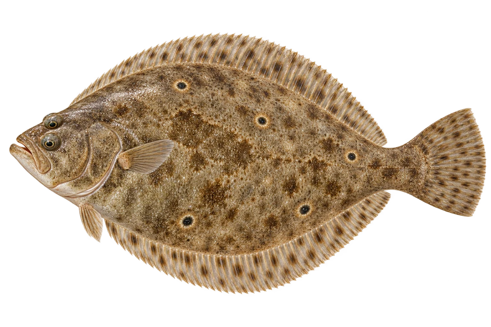

# 夏鲆（比目鱼）

Paralichthys dentatus · 鱼 · 2026-10-07

两只眼在同一侧，幼鱼发育前不同。

- **扁扁的身体**：夏鲆身体扁平，上面较深，下面较白。（VTH-AQ-01）
- **眼睛搬家**：它长大时，右边的眼睛会移到身体左边。（VTH-AQ-02）
- **颜色会变化**：它能改变身体颜色，配合周围海底的样子。（VTH-AQ-03）

资料：[NOAA Fisheries](https://www.fisheries.noaa.gov/species/summer-flounder)。位置：Identification / Summary / Biology / Habitat / species account。

[事实表](../claims.json) · [配音脚本](../scripts/audio-v1.json) · [生成提示与原图索引](../../../design/content/v1/generation.json)

每卡一段介绍、三个点听。新卡没有设置未经标定的局部放大坐标。图为 AI 原创艺术示意，非鉴定照片；交付为 2D 插画及图鉴内容，不代表新增三维捕获物种。
