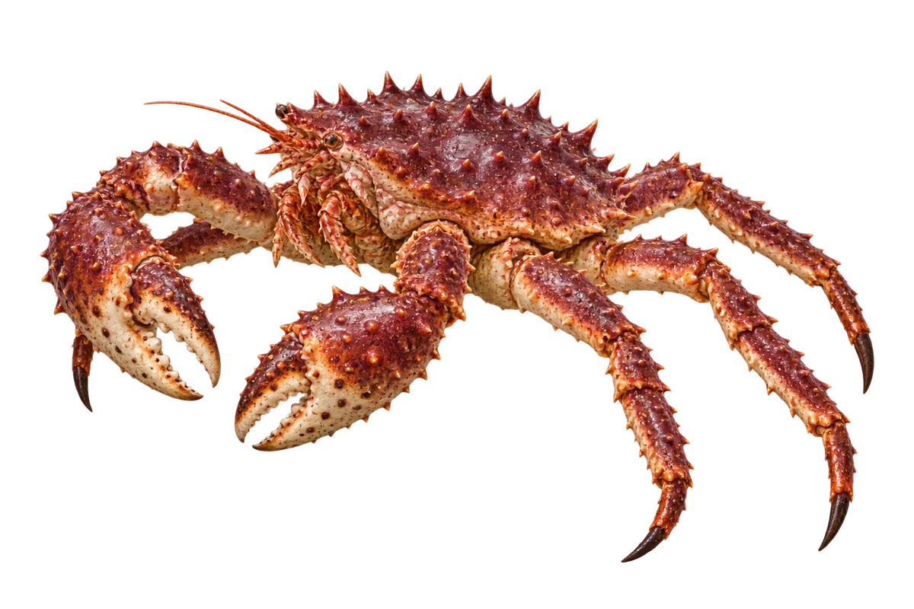

# 堪察加拟石蟹（帝王蟹）

Paralithodes camtschaticus · 蟹 · 2026-10-07

中文食材俗名仅作生活联系；本卡以明确学名表示活体，不作为野外采集、鉴定或可食判断。 拟石蟹属于异尾类；蟹按钮是外形与生活联系分组，不等于严格的短尾类分类。

- **带刺的壳**：背壳和脚上有尖尖的小刺。（VTH-CM-01）
- **三对步行脚**：能看到三对长长的步行脚，还有一对螯。（VTH-CM-02）
- **一大一小的螯**：两个螯形状不同，一个较大，一个较小。（VTH-CM-03）

资料：[NOAA Fisheries](https://www.fisheries.noaa.gov/species/red-king-crab)。位置：Appearance。

[事实表](../claims.json) · [配音脚本](../scripts/audio-v1.json) · [生成提示与原图索引](../../../design/content/v1/generation.json)

每卡一段介绍、三个点听。新卡没有设置未经标定的局部放大坐标。图为 AI 原创艺术示意，非鉴定照片；交付为 2D 插画及图鉴内容，不代表新增三维捕获物种。
