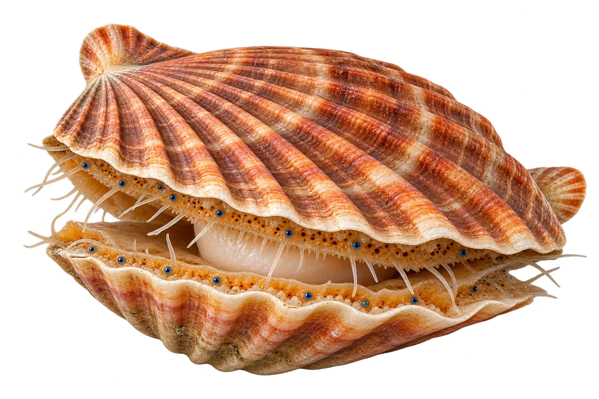

# 大扇贝

Pecten maximus · 双壳贝 · 2026-10-07

中文食材俗名仅作生活联系；本卡以明确学名表示活体，不作为野外采集、鉴定或可食判断。

- **扇形的壳**：两片壳像扇子一样展开。（VTH-DE-01）
- **凸壳和平壳**：一片壳比较鼓，另一片比较平。（VTH-DE-02）
- **沙砾底的家**：它能在海底沙砾中，找一个浅浅的凹窝。（VTH-DE-03）

资料：[Marine Biological Association / MarLIN](https://www.marlin.ac.uk/species/detail/1398)。位置：Description / identifying features / habitat。

[事实表](../claims.json) · [配音脚本](../scripts/audio-v1.json) · [生成提示与原图索引](../../../design/content/v1/generation.json)

每卡一段介绍、三个点听。新卡没有设置未经标定的局部放大坐标。图为 AI 原创艺术示意，非鉴定照片；交付为 2D 插画及图鉴内容，不代表新增三维捕获物种。
