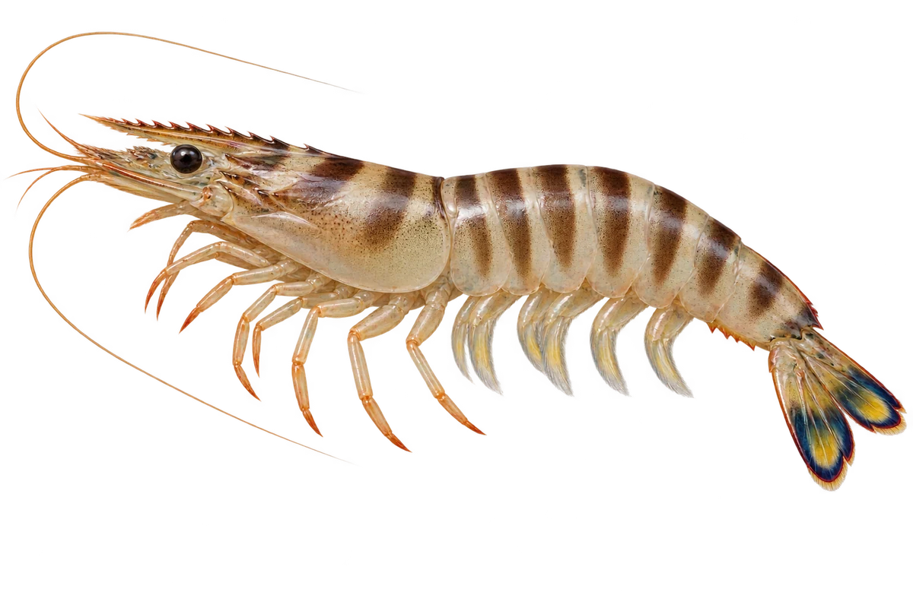

# 日本对虾（车虾）

Penaeus japonicus · 虾与龙虾 · 2026-10-07

中文食材俗名仅作生活联系；本卡以明确学名表示活体，不作为野外采集、鉴定或可食判断。

- **深色横带**：身体上有一条条深色横带。（VTH-CA-01）
- **黄色小脚**：小脚和触角上可以看到黄色。（VTH-CA-02）
- **彩色尾扇**：尾巴的扇形部分，可以带着蓝色和黄色。（VTH-CA-03）

资料：[FAO 联合国粮农组织](https://www.fao.org/4/ac741t/AC741T11.htm)。位置：Penaeus japonicus / colour。

[事实表](../claims.json) · [配音脚本](../scripts/audio-v1.json) · [生成提示与原图索引](../../../design/content/v1/generation.json)

每卡一段介绍、三个点听。新卡没有设置未经标定的局部放大坐标。图为 AI 原创艺术示意，非鉴定照片；交付为 2D 插画及图鉴内容，不代表新增三维捕获物种。
