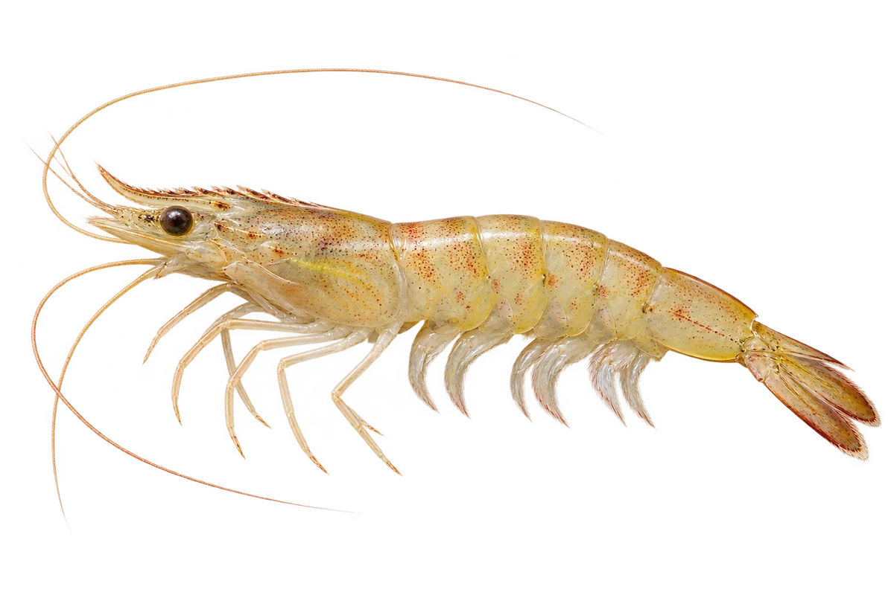

# 墨吉对虾（香蕉虾）

Penaeus merguiensis · 虾与龙虾 · 2026-10-07

中文食材俗名仅作生活联系；本卡以明确学名表示活体，不作为野外采集、鉴定或可食判断。

- **浅浅的颜色**：身体可以是浅黄色、粉色或灰绿色。（VTH-CB-01）
- **高高的额角**：头前的额角比较高，像一个小三角。（VTH-CB-02）
- **小小色点**：浅色身体上，可以看到细小的色点。（VTH-CB-03）

资料：[FAO 联合国粮农组织](https://www.fao.org/4/ad468e/AD468eQI.pdf)。位置：Penaeus merguiensis / diagnostic features。

[事实表](../claims.json) · [配音脚本](../scripts/audio-v1.json) · [生成提示与原图索引](../../../design/content/v1/generation.json)

每卡一段介绍、三个点听。新卡没有设置未经标定的局部放大坐标。图为 AI 原创艺术示意，非鉴定照片；交付为 2D 插画及图鉴内容，不代表新增三维捕获物种。
