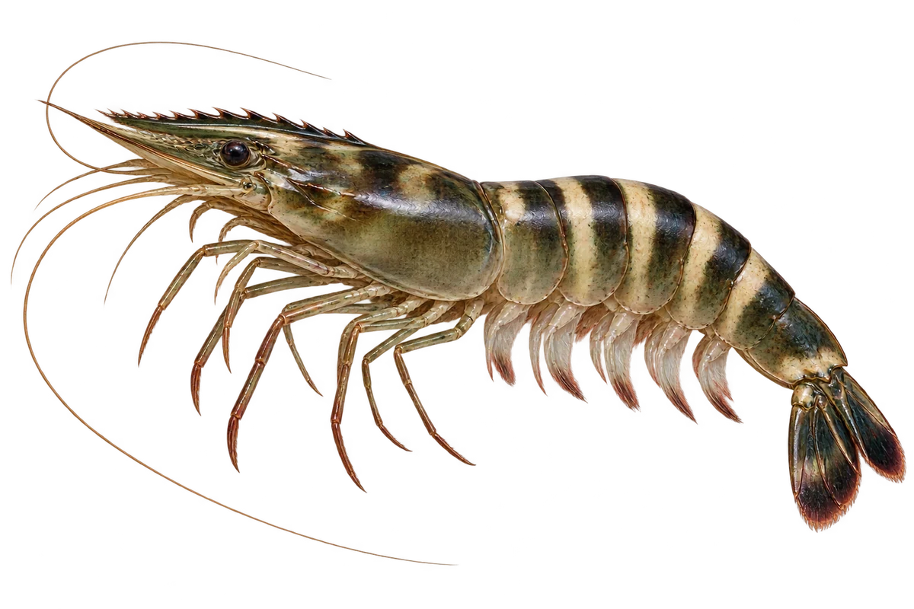

# 斑节对虾（虎虾）

Penaeus monodon · 虾与龙虾 · 2026-10-07

中文食材俗名仅作生活联系；本卡以明确学名表示活体，不作为野外采集、鉴定或可食判断。

- **深浅条带**：腹部一节一节的，上面有深浅相间的条带。（VTH-BY-01）
- **带齿的额角**：头前的尖尖额角，上面和下面都有小齿。（VTH-BY-02）
- **颜色有变化**：活着的虎虾颜色会变化，并不总是橙红色。（VTH-BY-03）

资料：[FAO 联合国粮农组织](https://www.fao.org/4/ac765t/AC765T05.htm)。位置：Penaeus monodon / morphology。

[事实表](../claims.json) · [配音脚本](../scripts/audio-v1.json) · [生成提示与原图索引](../../../design/content/v1/generation.json)

每卡一段介绍、三个点听。新卡没有设置未经标定的局部放大坐标。图为 AI 原创艺术示意，非鉴定照片；交付为 2D 插画及图鉴内容，不代表新增三维捕获物种。
