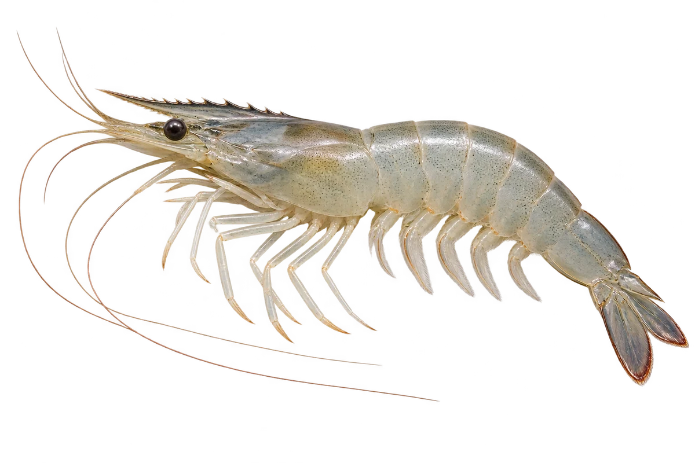

# 南美白对虾

Penaeus vannamei · 虾与龙虾 · 2026-10-07

中文食材俗名仅作生活联系；本卡以明确学名表示活体，不作为野外采集、鉴定或可食判断。

- **半透明身体**：活着的时候，身体常常白白的、半透明。（VTH-BZ-01）
- **带齿的额角**：头前有一段带着小齿的额角。（VTH-BZ-02）
- **长大换地方**：幼虾可以在河口长大，成虾生活在海里。（VTH-BZ-03）

资料：[FAO 联合国粮农组织](https://www.fao.org/fishery/docs/CDrom/aquaculture/I1129m/file/en/en_whitelegshrimp.htm)。位置：Biological features / Habitat。

[事实表](../claims.json) · [配音脚本](../scripts/audio-v1.json) · [生成提示与原图索引](../../../design/content/v1/generation.json)

每卡一段介绍、三个点听。新卡没有设置未经标定的局部放大坐标。图为 AI 原创艺术示意，非鉴定照片；交付为 2D 插画及图鉴内容，不代表新增三维捕获物种。
