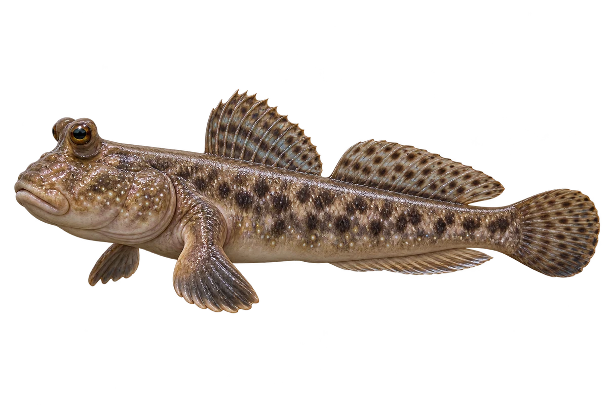

# 大弹涂鱼

Periophthalmodon schlosseri · 鱼 · 2026-10-07

属于鱼，生活在潮间带。

- **身旁的黑线**：它身体两侧有宽宽的黑色条纹。（VTH-AU-01）
- **泥滩上的鱼**：它住在红树林和潮间带泥滩，会在水外活动。（VTH-AU-02）
- **用鳍跳着走**：它两侧厚厚的胸鳍，能帮助它在泥上移动。（VTH-AU-03）

资料：[NParks Singapore](https://biodiversitysg.nparks.gov.sg/our-biodiversity/marine-fishes/giant-mudskipper/)。位置：Identification / Summary / Biology / Habitat / species account。

[事实表](../claims.json) · [配音脚本](../scripts/audio-v1.json) · [生成提示与原图索引](../../../design/content/v1/generation.json)

每卡一段介绍、三个点听。新卡没有设置未经标定的局部放大坐标。图为 AI 原创艺术示意，非鉴定照片；交付为 2D 插画及图鉴内容，不代表新增三维捕获物种。
