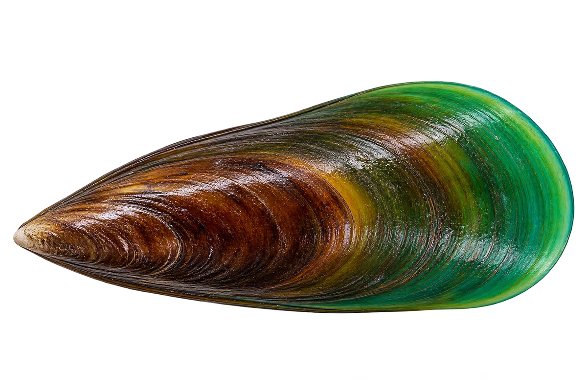

# 翡翠贻贝（青口）

Perna viridis · 双壳贝 · 2026-10-07

中文食材俗名仅作生活联系；本卡以明确学名表示活体，不作为野外采集、鉴定或可食判断。

- **绿色的壳**：幼小的时候，壳常常是鲜绿色。（VTH-DB-01）
- **长大变深**：长大以后，壳会变成较深的绿褐色。（VTH-DB-02）
- **用丝固定**：它用一束细丝，把自己固定在硬物上。（VTH-DB-03）

资料：[USGS](https://nas.er.usgs.gov/queries/FactSheet.aspx?SpeciesID=110)。位置：Identification / ecology。

[事实表](../claims.json) · [配音脚本](../scripts/audio-v1.json) · [生成提示与原图索引](../../../design/content/v1/generation.json)

每卡一段介绍、三个点听。新卡没有设置未经标定的局部放大坐标。图为 AI 原创艺术示意，非鉴定照片；交付为 2D 插画及图鉴内容，不代表新增三维捕获物种。
