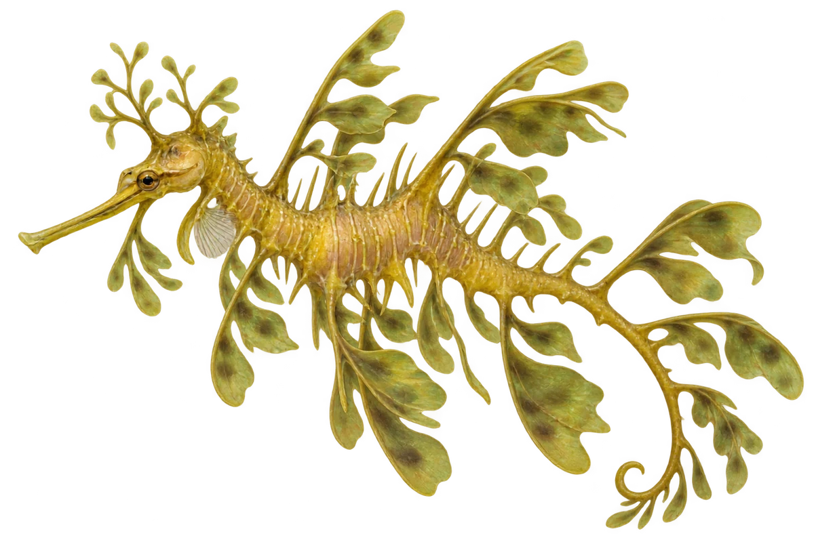

# 叶海龙

Phycodurus eques · 鱼 · 2026-10-07

以明确物种代表常用名称；插画是观察示意，不用来野外鉴定。

- **叶子一样的身体**：它身上有像叶子的突出部分，还有细长的管状嘴。（VTH-BQ-01）
- **海藻旁藏身**：它生活在澳大利亚温带海域的海藻岩礁。（VTH-BQ-02）
- **爸爸带着卵**：雄叶海龙会把卵带在尾巴下面。（VTH-BQ-03）

资料：[Australian Museum](https://australian.museum/learn/animals/fishes/leafy-seadragon-phycodurus-eques/)。位置：Identification / Summary / Biology / Habitat / species account。

[事实表](../claims.json) · [配音脚本](../scripts/audio-v1.json) · [生成提示与原图索引](../../../design/content/v1/generation.json)

每卡一段介绍、三个点听。新卡没有设置未经标定的局部放大坐标。图为 AI 原创艺术示意，非鉴定照片；交付为 2D 插画及图鉴内容，不代表新增三维捕获物种。
