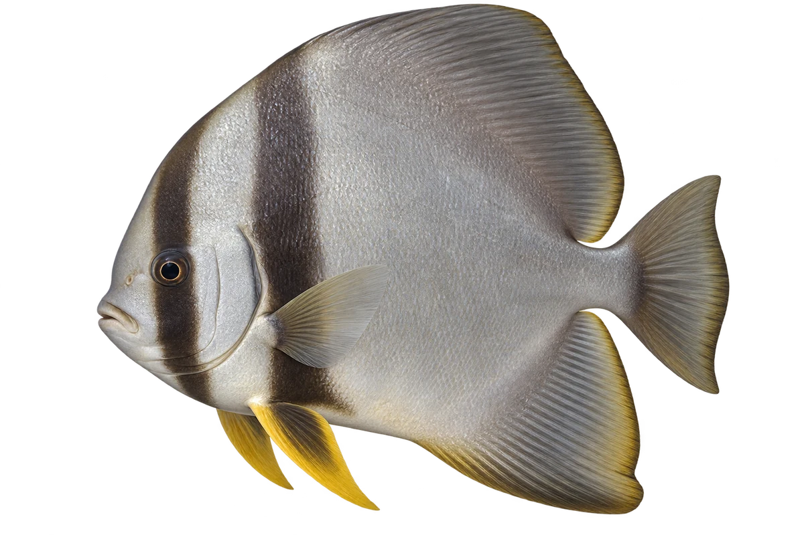

# 长鳍燕鱼

Platax teira · 鱼 · 2026-10-07

选择成鱼，幼鱼鳍更长。

- **高高扁扁**：它身体高而侧扁，胸鳍下面有深色斑块。（VTH-AL-01）
- **像一片小叶子**：很小的幼鱼是褐色的，看起来像漂浮的叶子。（VTH-AL-02）
- **食物不止一种**：它会吃藻类、浮游动物和海底小动物。（VTH-AL-03）

资料：[Museums Victoria / Fishes of Australia](https://fishesofaustralia.net.au/home/species/2210)。位置：Identification / Summary / Biology / Habitat / species account。

[事实表](../claims.json) · [配音脚本](../scripts/audio-v1.json) · [生成提示与原图索引](../../../design/content/v1/generation.json)

每卡一段介绍、三个点听。新卡没有设置未经标定的局部放大坐标。图为 AI 原创艺术示意，非鉴定照片；交付为 2D 插画及图鉴内容，不代表新增三维捕获物种。
