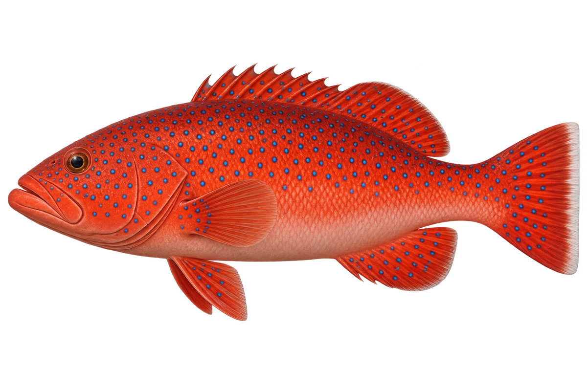

# 东星斑 · 内容包 v1

2026-10-06 · Plectropomus leopardus · 主要制作：主代理亲自完成。

## 观察与自由创作

孩子入口：看看这条红色的石斑鱼，蓝点好漂亮。

你的鱼想把蓝点放在什么颜色上？

| 点听 | 短句 | 事实依据 |
| --- | --- | --- |
| 蓝色小点 | 红色衣服上，还有蓝色小点。 | PL-01 |
| 不同的颜色 | 它也可以是绿褐色的。 | PL-02 |
| 尾巴的浅边 | 尾巴中间的鳍条，常有浅色边。 | PL-03 |

不是答题关卡。创作不要求与真实鱼一致；不同嘴、鳍、身体和花纹可以自由组合。

## 亲子解释与证据范围

东星斑是孩子入口工作名，本卡只对应 Plectropomus leopardus。选择红色成鱼；颜色不是固定身份标签。

本页事实引用 [claims.json](../claims.json)：PL-01、PL-02、PL-03。

- [Australian Museum：Common Coral Trout](https://australian.museum/learn/animals/fishes/common-coral-trout-plectropomus-leopardus/)

中文短名是孩子入口称呼，正式中文名为项目称呼或工作名；以学名明确对象，未统一认证所有地区俗名。艺术图不是照片，也不是精细分类检索图。

## 已制作素材

- [PNG 原始插画](../../../design/content/v1/illustrations/plectropomus-leopardus.png)
- [WebP 透明展示图](../../../public/content/v1/illustrations/plectropomus-leopardus.webp)
- [短介绍音频](../../../public/content/v1/audio/vo-pl-intro.wav)；另有 3 段点听音频，见 [脚本登记](../scripts/audio-v1.json)。
- [互动预览](../../../public/content/v1/index.html) 包含局部编号、重听、停止和亲子来源展开。

成品用于素材评审和接入准备。声音为系统合成试听，正式分发的声音授权单列；鱼的真实泳姿、精细三维结构和原目录全部历史行为仍不因插画完成而自动认证。
