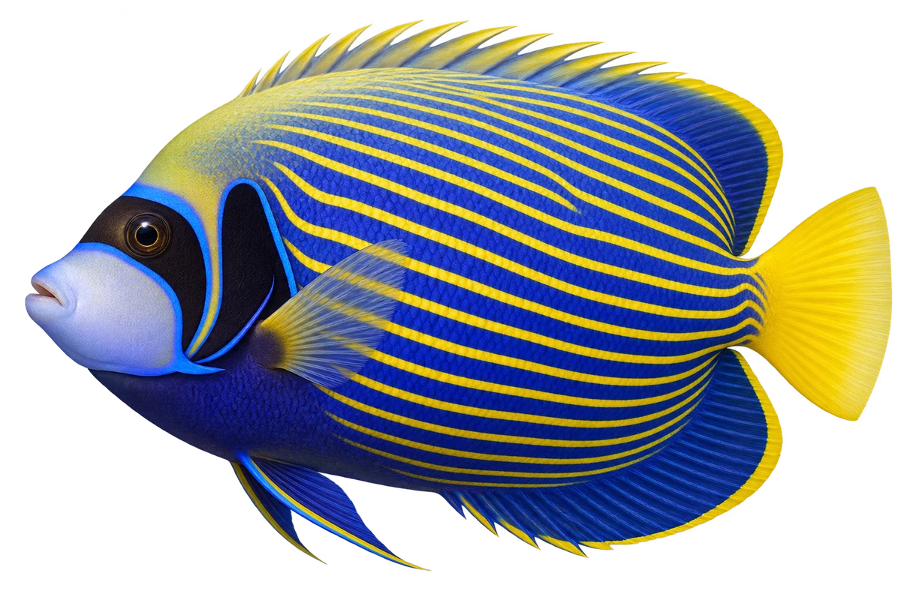

# 帝王神仙鱼 · 内容包 v1

2026-10-06 · Pomacanthus imperator · 主要制作：主代理亲自完成。

## 观察与自由创作

孩子入口：这条神仙鱼，穿着蓝黄条纹。

试试条纹，再给小鱼设计另一套圆环衣服。

| 点听 | 短句 | 事实依据 |
| --- | --- | --- |
| 蓝黄条纹 | 蓝色和黄色，排成一条条。 | PI-01 |
| 眼睛的黑带 | 眼睛这里，有一条弯弯的黑带。 | PI-02 |
| 小鱼的圆环 | 小时候，它穿的是圆环花纹。 | PI-03 |

不是答题关卡。创作不要求与真实鱼一致；不同嘴、鳍、身体和花纹可以自由组合。

## 亲子解释与证据范围

插画明确为成鱼；幼鱼圆环仅由亲子文字介绍，不能从成鱼插画直接找到。不同鱼龄画面后续可独立制作。

本页事实引用 [claims.json](../claims.json)：PI-01、PI-02、PI-03。

- [Australian Museum：Emperor Angelfish](https://australian.museum/learn/animals/fishes/emperor-angelfish-pomacanthus-imperator/)

中文短名是孩子入口称呼，正式中文名为项目称呼或工作名；以学名明确对象，未统一认证所有地区俗名。艺术图不是照片，也不是精细分类检索图。

## 已制作素材

- [PNG 原始插画](../../../design/content/v1/illustrations/pomacanthus-imperator.png)
- [WebP 透明展示图](../../../public/content/v1/illustrations/pomacanthus-imperator.webp)
- [短介绍音频](../../../public/content/v1/audio/vo-pi-intro.wav)；另有 3 段点听音频，见 [脚本登记](../scripts/audio-v1.json)。
- [互动预览](../../../public/content/v1/index.html) 包含局部编号、重听、停止和亲子来源展开。

成品用于素材评审和接入准备。声音为系统合成试听，正式分发的声音授权单列；鱼的真实泳姿、精细三维结构和原目录全部历史行为仍不因插画完成而自动认证。
