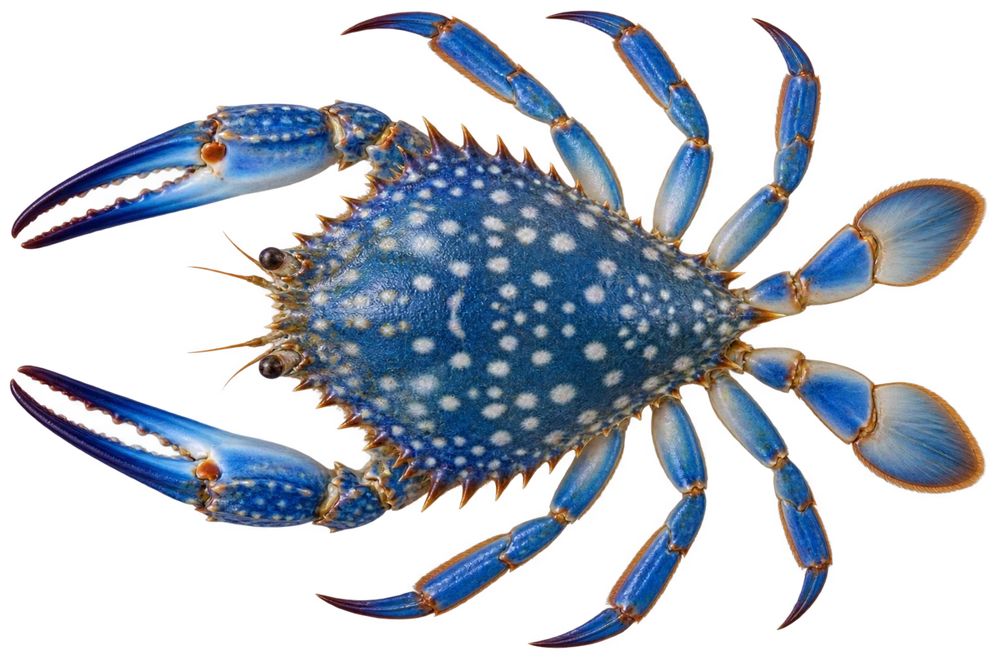

# 远海梭子蟹（花蟹）

Portunus pelagicus · 蟹 · 2026-10-07

中文食材俗名仅作生活联系；本卡以明确学名表示活体，不作为野外采集、鉴定或可食判断。

- **扇形的壳**：身体的壳像一把扇子，两侧有尖齿。（VTH-CI-01）
- **小桨一样的脚**：最后一对脚扁扁的，可以帮助游泳。（VTH-CI-02）
- **藏进沙泥**：它会藏进沙泥里，也会在海草附近活动。（VTH-CI-03）

资料：[NParks Singapore](https://www.nparks.gov.sg/florafaunaweb/fauna/1/2/1207)。位置：Physical / Ecology。

[事实表](../claims.json) · [配音脚本](../scripts/audio-v1.json) · [生成提示与原图索引](../../../design/content/v1/generation.json)

每卡一段介绍、三个点听。新卡没有设置未经标定的局部放大坐标。图为 AI 原创艺术示意，非鉴定照片；交付为 2D 插画及图鉴内容，不代表新增三维捕获物种。
