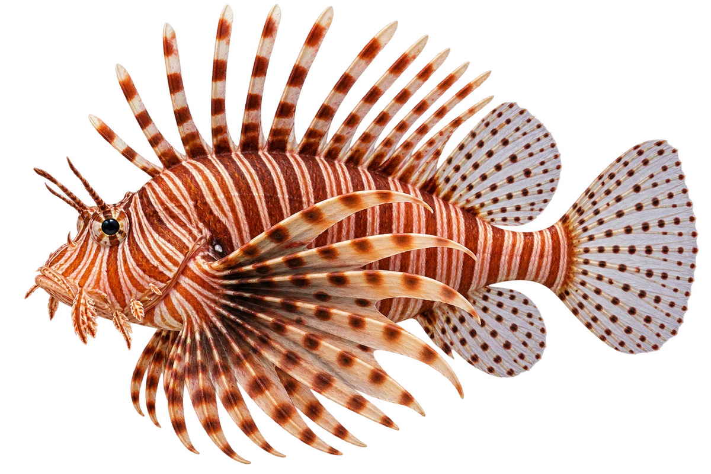

# 蓑鲉（狮子鱼）

Pterois volitans · 鱼 · 2026-10-07

以明确物种代表常用名称；插画是观察示意，不用来野外鉴定。

- **长长的鳍**：它胸鳍和背鳍很长，浅色身体上有红色到黑色条带。（VTH-BS-01）
- **眼睛上有小须**：它两只眼睛上方，通常各有一个突出的小须。（VTH-BS-02）
- **热带海洋**：它原本广泛分布在热带印度洋和太平洋。（VTH-BS-03）

资料：[Australian Museum](https://australian.museum/learn/animals/fishes/common-lionfish-pterois-volitans/)。位置：Identification / Summary / Biology / Habitat / species account。

[事实表](../claims.json) · [配音脚本](../scripts/audio-v1.json) · [生成提示与原图索引](../../../design/content/v1/generation.json)

每卡一段介绍、三个点听。新卡没有设置未经标定的局部放大坐标。图为 AI 原创艺术示意，非鉴定照片；交付为 2D 插画及图鉴内容，不代表新增三维捕获物种。
