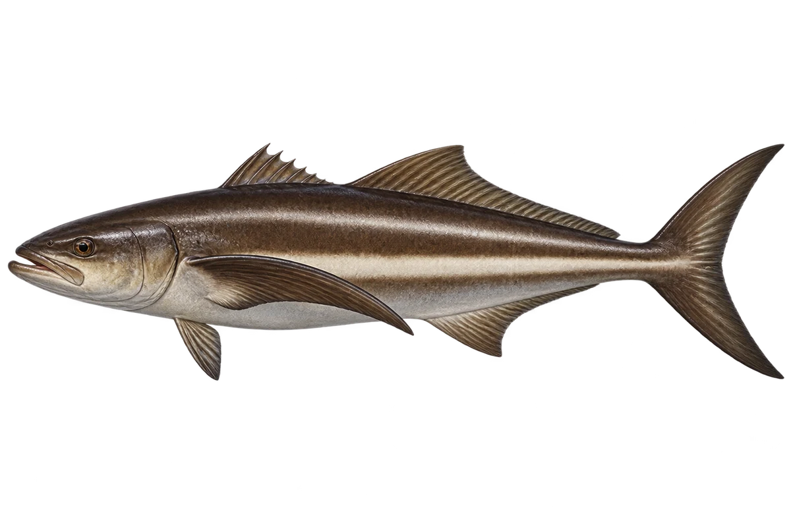

# 军曹鱼

Rachycentron canadum · 鱼 · 2026-10-07

军曹鱼另属军曹鱼科，不能按中文鲹类名称归类。

- **长长的身体**：军曹鱼身体细长，下巴向前伸。（VTH-AB-01）
- **尖尖的胸鳍**：它两侧的胸鳍向后伸，末端尖尖的。（VTH-AB-02）
- **暖海伙伴**：它生活在温暖的近海，也会进入河口。（VTH-AB-03）

资料：[Museums Victoria / Fishes of Australia](https://fishesofaustralia.net.au/home/species/4421)。位置：Identification / Summary / Biology / Habitat / species account。

[事实表](../claims.json) · [配音脚本](../scripts/audio-v1.json) · [生成提示与原图索引](../../../design/content/v1/generation.json)

每卡一段介绍、三个点听。新卡没有设置未经标定的局部放大坐标。图为 AI 原创艺术示意，非鉴定照片；交付为 2D 插画及图鉴内容，不代表新增三维捕获物种。
