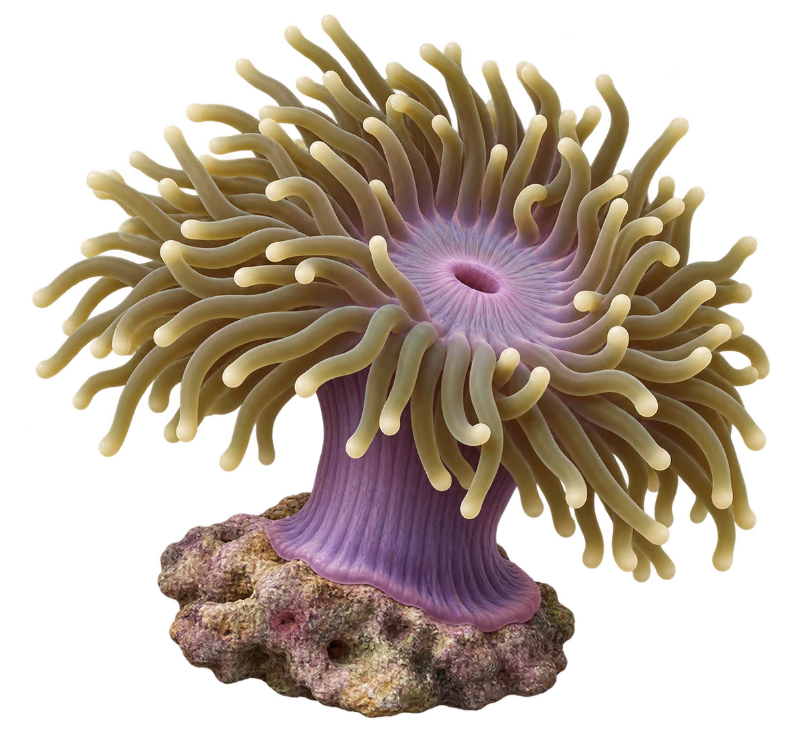

# Radianthus magnifica · 海葵内容包

2026-10-06 · 主代理亲自制作与核对。旧资料使用 Heteractis magnifica；当前命名映射证据见 RM-01（WoRMS 索引及图片物种标签，详情页读取限制仍登记）。

这是与本包眼斑双锯鱼建立宿主关系的一种明确海葵。孩子点听：这是一只海葵，也是这种小丑鱼的伙伴。

形态依据 RM-03、RM-04：2021 年红海与亚丁湾实地研究记录长触手、圆或微膨端部、红至紫色柱体与暴露礁石附着。紫柱与绿触手是选择的示意色型；不是所有个体的唯一颜色，也不证明当前两种鱼葵在同一新加坡地点出现。

- [原始研究：Bennett-Smith 等（2021）](https://link.springer.com/article/10.1186/s41200-021-00216-6)，Results / Heteractis magnifica。
- [事实表](../claims.json)：AO-03、RM-01、RM-02、RM-03、RM-04。
- [可编辑配对参考图](../../../public/content/v1/guides/host-partners.svg)
- [透明 WebP](../../../public/content/v1/illustrations/radianthus-magnifica.webp)、[PNG 原图](../../../design/content/v1/illustrations/radianthus-magnifica.png)、[中文声音](../../../public/content/v1/audio/vo-rm-intro.wav)

完成的是 2D 观察插画与关系素材。制作任务 MAKE-RM-MODEL 的命名来自原计划；本轮没有新增海葵 GLB 或认证触手动画。
