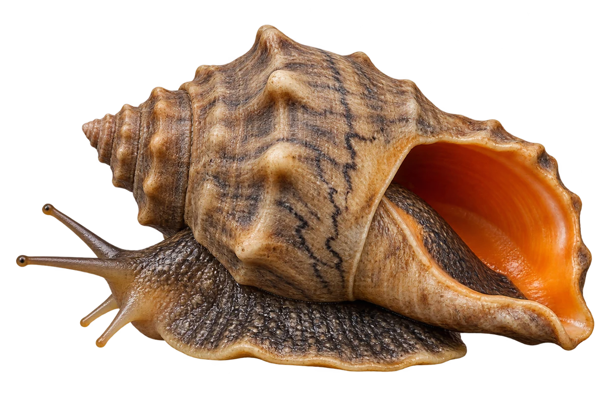

# 脉红螺（海螺）

Rapana venosa · 螺与鲍鱼 · 2026-10-07

中文食材俗名仅作生活联系；本卡以明确学名表示活体，不作为野外采集、鉴定或可食判断。

- **圆鼓鼓的壳**：壳的最后一圈大大鼓起，顶端较短。（VTH-CX-01）
- **橙色壳口**：壳口里面可以是橙色的。（VTH-CX-02）
- **深色细纹**：螺壳上可以有深色的脉状花纹。（VTH-CX-03）

资料：[USGS](https://nas.er.usgs.gov/Queries/FactSheet.aspx?SpeciesID=1018)。位置：Identification / habitat。

[事实表](../claims.json) · [配音脚本](../scripts/audio-v1.json) · [生成提示与原图索引](../../../design/content/v1/generation.json)

每卡一段介绍、三个点听。新卡没有设置未经标定的局部放大坐标。图为 AI 原创艺术示意，非鉴定照片；交付为 2D 插画及图鉴内容，不代表新增三维捕获物种。
