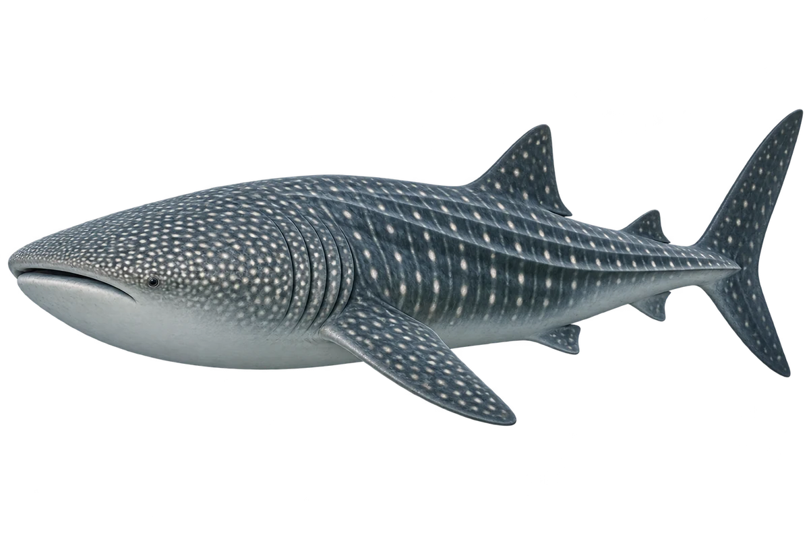

# 鲸鲨

Rhincodon typus · 鱼 · 2026-10-07

鲸鲨是鱼，不是鲸。

- **点点和格纹**：鲸鲨的深色背部有浅色点点和条纹。（VTH-AS-01）
- **宽头大嘴**：它的头很宽、很平，嘴在头部前方。（VTH-AS-02）
- **过滤食物**：它能把水吸进大嘴，过滤浮游动物和其他小食物。（VTH-AS-03）

资料：[Florida Museum](https://www.floridamuseum.ufl.edu/discover-fish/species-profiles/whale-shark/)。位置：Identification / Summary / Biology / Habitat / species account。

[事实表](../claims.json) · [配音脚本](../scripts/audio-v1.json) · [生成提示与原图索引](../../../design/content/v1/generation.json)

每卡一段介绍、三个点听。新卡没有设置未经标定的局部放大坐标。图为 AI 原创艺术示意，非鉴定照片；交付为 2D 插画及图鉴内容，不代表新增三维捕获物种。
