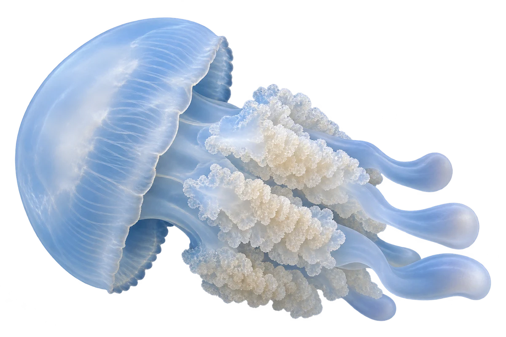

# 海蜇

Rhopilema esculentum · 其他伙伴 · 2026-10-07

中文食材俗名仅作生活联系；本卡以明确学名表示活体，不作为野外采集、鉴定或可食判断。

- **伞状的身体**：身体上面像一把圆圆的伞。（VTH-DK-01）
- **下面的口腕**：伞的下面，有一簇口腕。（VTH-DK-02）
- **它是水母**：海蜇属于水母，和鱼不属于同一类。（VTH-DK-03）

资料：[台湾政府机构／海洋与渔业资料](https://scitechvista.nat.gov.tw/Article/c000003/detail?ID=8dab73f1-bbd5-4b70-b7c6-559a04580972)、[台湾政府机构／海洋与渔业资料](https://www.tfrin.gov.tw/theme_data.php?id=420&sub_theme=G&theme=epaper_data)。位置：Rhopilema esculentum / umbrella / oral arms。

[事实表](../claims.json) · [配音脚本](../scripts/audio-v1.json) · [生成提示与原图索引](../../../design/content/v1/generation.json)

每卡一段介绍、三个点听。新卡没有设置未经标定的局部放大坐标。图为 AI 原创艺术示意，非鉴定照片；交付为 2D 插画及图鉴内容，不代表新增三维捕获物种。
