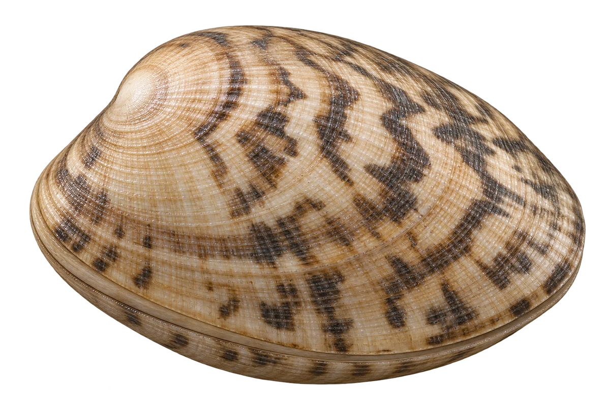

# 菲律宾蛤仔（花蛤）

Ruditapes philippinarum · 双壳贝 · 2026-10-07

中文食材俗名仅作生活联系；本卡以明确学名表示活体，不作为野外采集、鉴定或可食判断。

- **两片椭圆壳**：身体外面，有两片椭圆的壳。（VTH-CZ-01）
- **交叉小纹路**：壳上的横纹和放射纹，交织成小格子。（VTH-CZ-02）
- **沙泥中的家**：可以生活在浅海沙泥或沙砾底。（VTH-CZ-03）

资料：[FAO 联合国粮农组织](https://www.fao.org/fishery/docs/CDrom/aquaculture/I1129m/file/en/en_japanesecarpetshell.htm)。位置：Biological features / habitat。

[事实表](../claims.json) · [配音脚本](../scripts/audio-v1.json) · [生成提示与原图索引](../../../design/content/v1/generation.json)

每卡一段介绍、三个点听。新卡没有设置未经标定的局部放大坐标。图为 AI 原创艺术示意，非鉴定照片；交付为 2D 插画及图鉴内容，不代表新增三维捕获物种。
