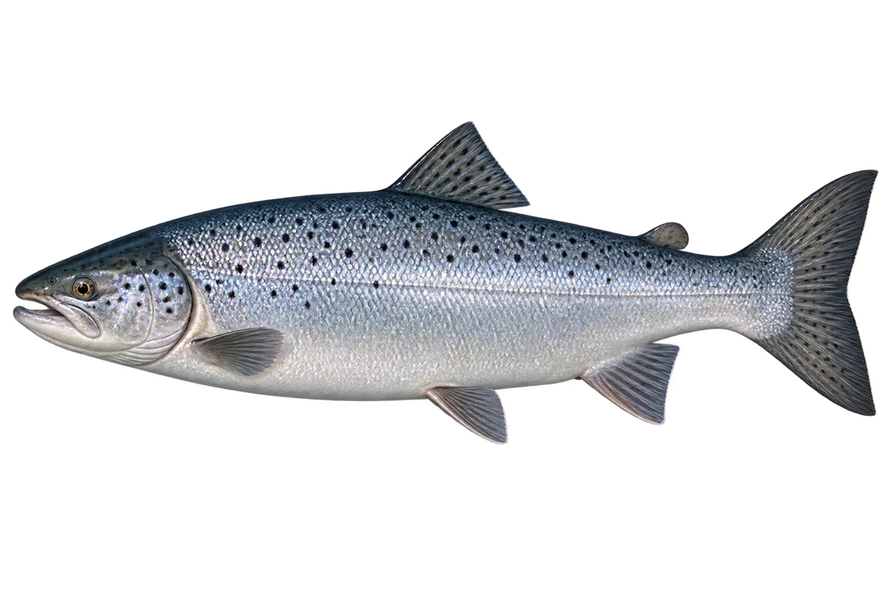

# 大西洋鲑（三文鱼）

Salmo salar · 鱼 · 2026-10-07

选海洋阶段；不是所有叫三文鱼的商品都指这个物种。

- **海里的银色**：大西洋鲑在海里时，身体两侧是银色的。（VTH-AN-01）
- **幼鱼有条纹**：幼鱼颜色偏褐，身上有深色竖条和小点。（VTH-AN-02）
- **河流和海洋**：它在河里出生，到海里长大，再回河里繁殖。（VTH-AN-03）

资料：[NOAA Fisheries](https://www.fisheries.noaa.gov/species/atlantic-salmon)。位置：Identification / Summary / Biology / Habitat / species account。

[事实表](../claims.json) · [配音脚本](../scripts/audio-v1.json) · [生成提示与原图索引](../../../design/content/v1/generation.json)

每卡一段介绍、三个点听。新卡没有设置未经标定的局部放大坐标。图为 AI 原创艺术示意，非鉴定照片；交付为 2D 插画及图鉴内容，不代表新增三维捕获物种。
