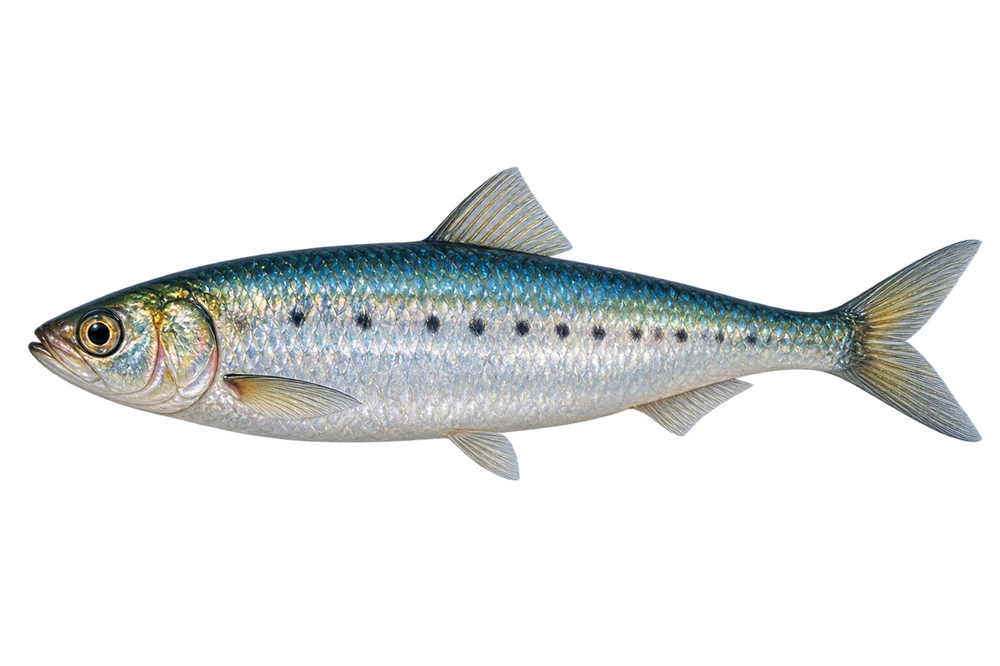

# 欧洲沙丁鱼

Sardina pilchardus · 鱼 · 2026-10-07

以明确物种代表常用名称；插画是观察示意，不用来野外鉴定。

- **背绿肚子银**：它背部绿色或橄榄色，肚子银白，体侧有深色小点。（VTH-BJ-01）
- **一大群一起游**：它是沿岸的鱼，会组成很大的鱼群。（VTH-BJ-02）
- **吃浮游动物**：它主要吃水中小型甲壳类等浮游动物。（VTH-BJ-03）

资料：[FAO 联合国粮农组织](https://www.fao.org/fishery/docs/CDrom/ARTFIMED/ArtFiWeb/descript/Species/CLUSAPIL.HTML)。位置：Identification / Summary / Biology / Habitat / species account。

[事实表](../claims.json) · [配音脚本](../scripts/audio-v1.json) · [生成提示与原图索引](../../../design/content/v1/generation.json)

每卡一段介绍、三个点听。新卡没有设置未经标定的局部放大坐标。图为 AI 原创艺术示意，非鉴定照片；交付为 2D 插画及图鉴内容，不代表新增三维捕获物种。
