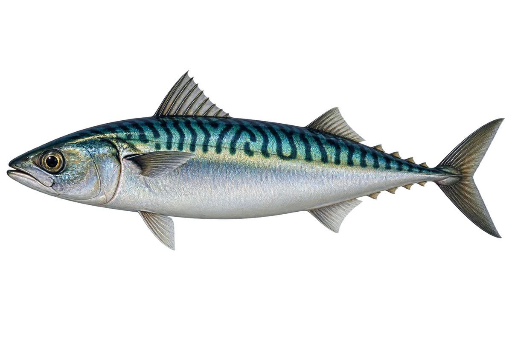

# 大西洋鲭

Scomber scombrus · 鱼 · 2026-10-07

波纹在背部，腹部较浅。

- **背上的波浪线**：它的蓝绿色背部有深色波浪线，肚子较白。（VTH-AO-01）
- **流线形身体**：它身体两头较细，像一枚小梭子。（VTH-AO-02）
- **吃什么**：它会吃小虾、小鱼和其他海里小动物。（VTH-AO-03）

资料：[NOAA Fisheries](https://www.fisheries.noaa.gov/species/atlantic-mackerel)。位置：Identification / Summary / Biology / Habitat / species account。

[事实表](../claims.json) · [配音脚本](../scripts/audio-v1.json) · [生成提示与原图索引](../../../design/content/v1/generation.json)

每卡一段介绍、三个点听。新卡没有设置未经标定的局部放大坐标。图为 AI 原创艺术示意，非鉴定照片；交付为 2D 插画及图鉴内容，不代表新增三维捕获物种。
