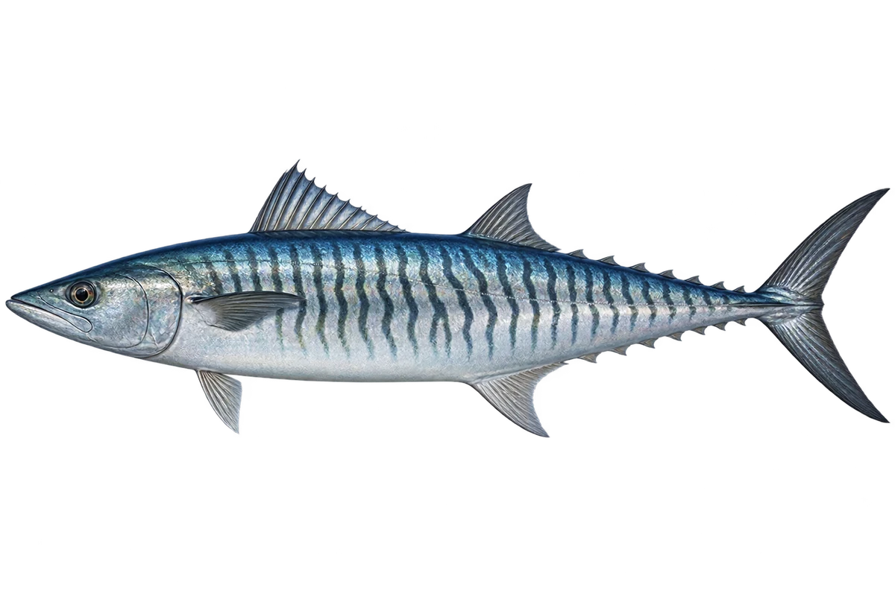

# 康氏马鲛 · 内容包 v1

2026-10-06 · Scomberomorus commerson · 主要制作：主代理亲自完成。

## 观察与自由创作

孩子入口：这条马鲛鱼，穿着细细的波纹。

你的鱼想画直线，还是弯弯的波浪？

| 点听 | 短句 | 事实依据 |
| --- | --- | --- |
| 细细的波纹 | 身上有好多细细的波浪带子。 | SC-01 |
| 蓝灰与银色 | 背上蓝灰，身体侧边银亮亮。 | SC-02 |
| 小鱼的花纹 | 小时候，常常是点点花纹。 | SC-03 |

不是答题关卡。创作不要求与真实鱼一致；不同嘴、鳍、身体和花纹可以自由组合。

## 亲子解释与证据范围

本卡对应康氏马鲛 S. commerson 的成鱼条带色型；幼鱼另有点纹。马鲛俗名覆盖多种鱼，不能混为一种。

本页事实引用 [claims.json](../claims.json)：SC-01、SC-02、SC-03。

- [Museums Victoria / Fishes of Australia：Spanish Mackerel](https://fishesofaustralia.net.au/home/species/728)

中文短名是孩子入口称呼，正式中文名为项目称呼或工作名；以学名明确对象，未统一认证所有地区俗名。艺术图不是照片，也不是精细分类检索图。

## 已制作素材

- [PNG 原始插画](../../../design/content/v1/illustrations/scomberomorus-commerson.png)
- [WebP 透明展示图](../../../public/content/v1/illustrations/scomberomorus-commerson.webp)
- [短介绍音频](../../../public/content/v1/audio/vo-sc-intro.wav)；另有 3 段点听音频，见 [脚本登记](../scripts/audio-v1.json)。
- [互动预览](../../../public/content/v1/index.html) 包含局部编号、重听、停止和亲子来源展开。

成品用于素材评审和接入准备。声音为系统合成试听，正式分发的声音授权单列；鱼的真实泳姿、精细三维结构和原目录全部历史行为仍不因插画完成而自动认证。
