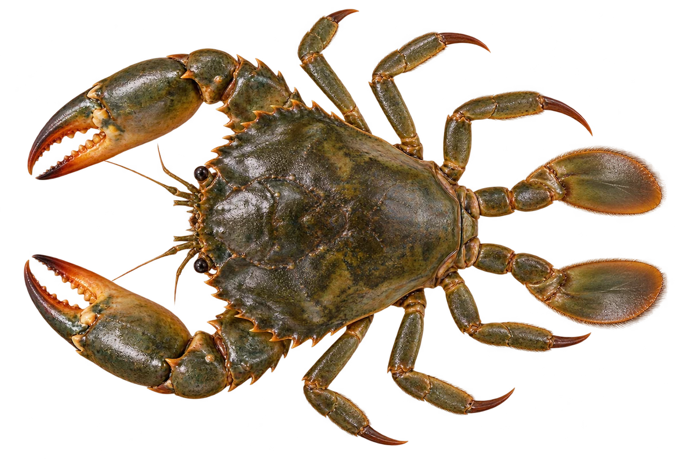

# 锯缘青蟹

Scylla serrata · 蟹 · 2026-10-07

中文食材俗名仅作生活联系；本卡以明确学名表示活体，不作为野外采集、鉴定或可食判断。

- **深色的壳**：壳可以是绿色到近黑色。（VTH-CH-01）
- **有力的大螯**：前面有一对粗壮的大螯。（VTH-CH-02）
- **泥底的家**：可以生活在近岸泥底和红树林附近。（VTH-CH-03）

资料：[FAO 联合国粮农组织](https://openknowledge.fao.org/server/api/core/bitstreams/f32d004b-6358-44f3-8242-b9d23e5346d0/content)。位置：Scylla serrata species account。

[事实表](../claims.json) · [配音脚本](../scripts/audio-v1.json) · [生成提示与原图索引](../../../design/content/v1/generation.json)

每卡一段介绍、三个点听。新卡没有设置未经标定的局部放大坐标。图为 AI 原创艺术示意，非鉴定照片；交付为 2D 插画及图鉴内容，不代表新增三维捕获物种。
