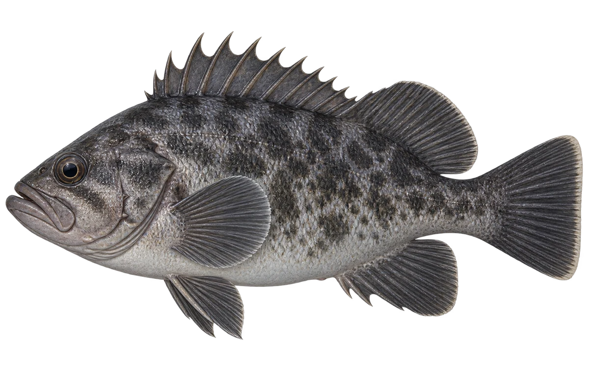

# 许氏平鲉 · 内容包 v1

2026-10-06 · Sebastes schlegelii · 主要制作：主代理亲自完成。

## 观察与自由创作

孩子入口：这条鱼，生活在近岸的岩礁。

给你的鱼画几块不规则的斑点，再选一块石头旁的家。

| 点听 | 短句 | 事实依据 |
| --- | --- | --- |
| 岩礁的家 | 它的家，在近岸的岩礁。 | SS-01 |
| 小鱼与海藻 | 小时候，它可以和漂浮的海藻一起出现。 | SS-02 |
| 鱼宝宝 | 它的宝宝，先在妈妈身体里发育。 | SS-03 |

不是答题关卡。创作不要求与真实鱼一致；不同嘴、鳍、身体和花纹可以自由组合。

## 亲子解释与证据范围

本批核对栖所、幼鱼阶段与卵胎生。灰黑插画是外形近似，旧目录毒性与出生即会游的断言未作为已核对新内容；未使用该部分口播。

本页事实引用 [claims.json](../claims.json)：SS-01、SS-02、SS-03。

- [FishBase：Sebastes schlegelii](https://www.fishbase.se/summary/Sebastes-schlegelii.html)

中文短名是孩子入口称呼，正式中文名为项目称呼或工作名；以学名明确对象，未统一认证所有地区俗名。艺术图不是照片，也不是精细分类检索图。

## 已制作素材

- [PNG 原始插画](../../../design/content/v1/illustrations/sebastes-schlegelii.png)
- [WebP 透明展示图](../../../public/content/v1/illustrations/sebastes-schlegelii.webp)
- [短介绍音频](../../../public/content/v1/audio/vo-ss-intro.wav)；另有 3 段点听音频，见 [脚本登记](../scripts/audio-v1.json)。
- [互动预览](../../../public/content/v1/index.html) 包含局部编号、重听、停止和亲子来源展开。

成品用于素材评审和接入准备。声音为系统合成试听，正式分发的声音授权单列；鱼的真实泳姿、精细三维结构和原目录全部历史行为仍不因插画完成而自动认证。
