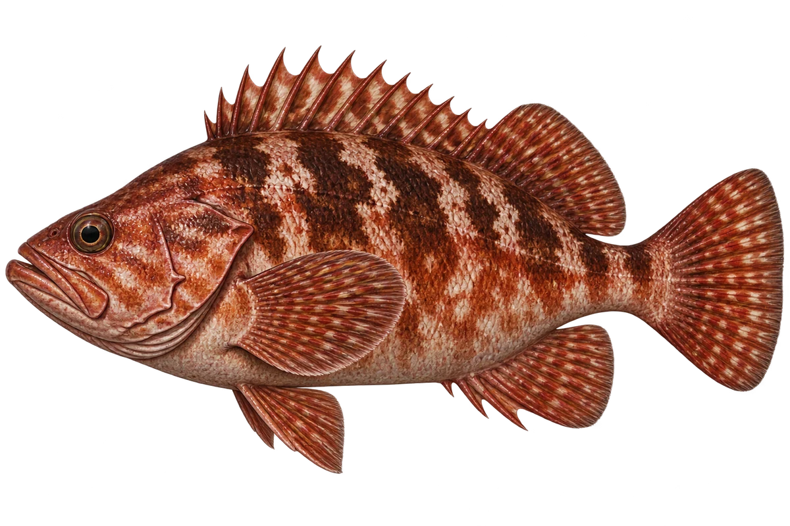

# 褐菖鲉 · 内容包 v1

2026-10-06 · Sebastiscus marmoratus · 主要制作：主代理亲自完成。

## 观察与自由创作

孩子入口：看看岩礁里的这条鱼，这张图选了红褐色。

给你的鱼混合两种颜色，画出不规则的花纹。

| 点听 | 短句 | 事实依据 |
| --- | --- | --- |
| 变化的颜色 | 它的颜色，会随着生活条件有所不同。 | SM-01 |
| 浅海岩礁 | 它生活在浅海的岩礁底部。 | SM-02 |
| 吃小鱼 | 它的食物里，主要有小鱼。 | SM-03 |

不是答题关卡。创作不要求与真实鱼一致；不同嘴、鳍、身体和花纹可以自由组合。

## 亲子解释与证据范围

颜色有个体和环境条件变化，红褐色是插画选择。尾部按大体轮廓示意，不认证旧资料中的精确横带数。

本页事实引用 [claims.json](../claims.json)：SM-01、SM-02、SM-03。

- [中央研究院生物多樣性研究中心／臺灣魚類資料庫：Sebastiscus marmoratus](https://catalog.digitalarchives.tw/item/00/42/6f/31.html)

中文短名是孩子入口称呼，正式中文名为项目称呼或工作名；以学名明确对象，未统一认证所有地区俗名。艺术图不是照片，也不是精细分类检索图。

## 已制作素材

- [PNG 原始插画](../../../design/content/v1/illustrations/sebastiscus-marmoratus.png)
- [WebP 透明展示图](../../../public/content/v1/illustrations/sebastiscus-marmoratus.webp)
- [短介绍音频](../../../public/content/v1/audio/vo-sm-intro.wav)；另有 3 段点听音频，见 [脚本登记](../scripts/audio-v1.json)。
- [互动预览](../../../public/content/v1/index.html) 包含局部编号、重听、停止和亲子来源展开。

成品用于素材评审和接入准备。声音为系统合成试听，正式分发的声音授权单列；鱼的真实泳姿、精细三维结构和原目录全部历史行为仍不因插画完成而自动认证。
