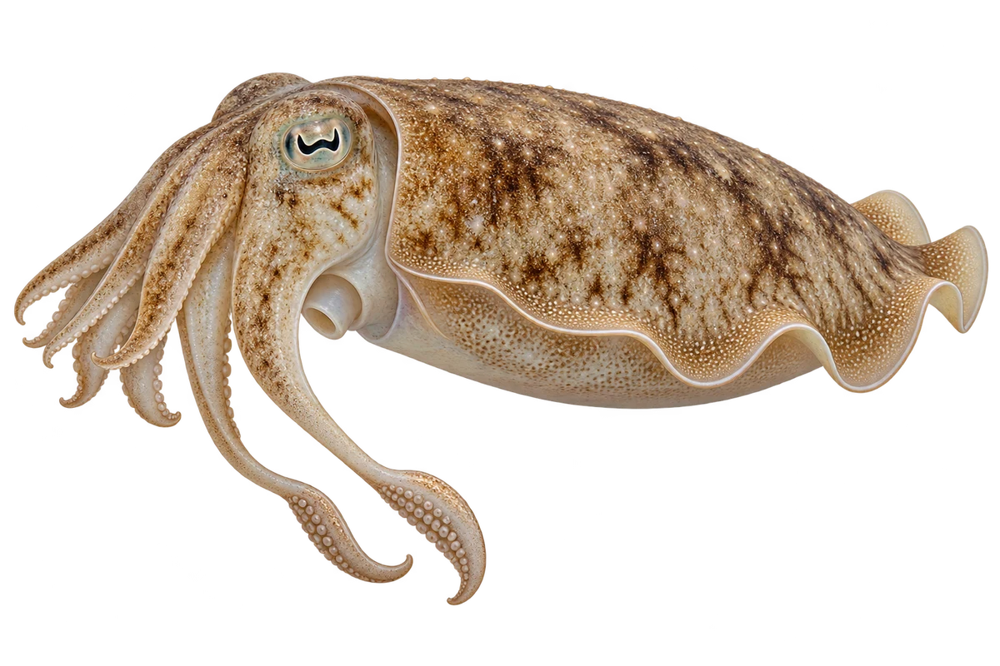

# 普通乌贼（墨鱼）

Sepia officinalis · 鱿鱼与章鱼 · 2026-10-07

中文食材俗名仅作生活联系；本卡以明确学名表示活体，不作为野外采集、鉴定或可食判断。

- **颜色会变化**：它会改变身体的颜色、图案和表面样子。（VTH-CR-01）
- **八加二**：鱿鱼和乌贼有八条腕，还有两条较长的触腕。（VTH-CR-02）
- **吃小动物**：它会吃虾、蟹、小鱼和一些贝类。（VTH-CR-03）

资料：[Monterey Bay Aquarium](https://www.montereybayaquarium.org/animals-the-ocean/animals-a-to-z/common-cuttlefish)、[Monterey Bay Aquarium](https://www.montereybayaquarium.org/animals-the-ocean/animals-a-to-z/cephalopods)。位置：Description / camouflage / diet。

[事实表](../claims.json) · [配音脚本](../scripts/audio-v1.json) · [生成提示与原图索引](../../../design/content/v1/generation.json)

每卡一段介绍、三个点听。新卡没有设置未经标定的局部放大坐标。图为 AI 原创艺术示意，非鉴定照片；交付为 2D 插画及图鉴内容，不代表新增三维捕获物种。
