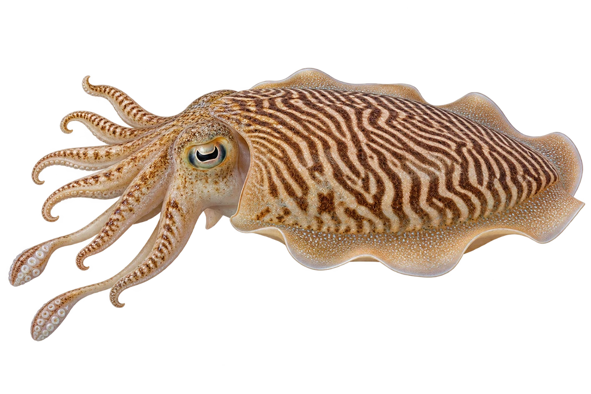

# 虎斑乌贼

Acanthosepion pharaonis · 鱿鱼与章鱼 · 2026-10-07

中文食材俗名仅作生活联系；本卡以明确学名表示活体，不作为野外采集、鉴定或可食判断。 WoRMS 当前接受名为 Acanthosepion pharaonis；FAO 2005 使用旧组合 Sepia pharaonis，图片生成原始提示按当时的制作输入保留。

- **虎斑花衣服**：头和腕上，可以出现深浅相间的虎斑纹。（VTH-CQ-01）
- **八加二**：鱿鱼和乌贼有八条腕，还有两条较长的触腕。（VTH-CQ-02）
- **一串串的卵**：卵会成簇地附着在植物、贝壳等物体上。（VTH-CQ-03）

资料：[FAO 联合国粮农组织](https://www.fao.org/4/a0150e/a0150e12.pdf)、[Monterey Bay Aquarium](https://www.montereybayaquarium.org/animals-the-ocean/animals-a-to-z/cephalopods)、[WoRMS](https://www.marinespecies.org/aphia.php?id=1666972&p=taxdetails)。位置：pp 106–108 / diagnostic features / biology。

[事实表](../claims.json) · [配音脚本](../scripts/audio-v1.json) · [生成提示与原图索引](../../../design/content/v1/generation.json)

每卡一段介绍、三个点听。新卡没有设置未经标定的局部放大坐标。图为 AI 原创艺术示意，非鉴定照片；交付为 2D 插画及图鉴内容，不代表新增三维捕获物种。
