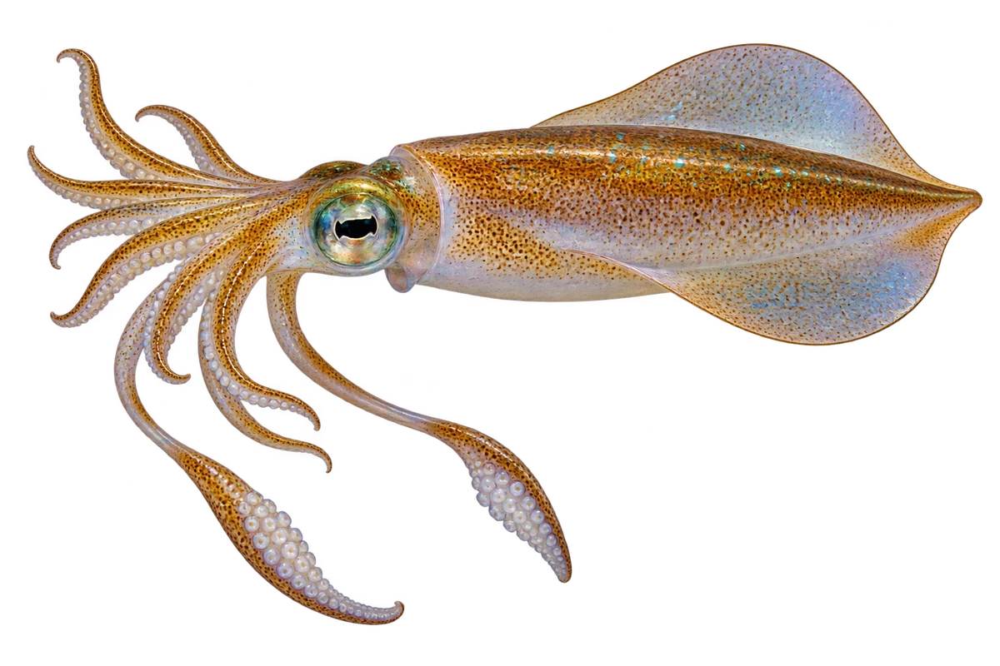

# 莱氏拟乌贼（大鳍鱿鱼）

Sepioteuthis lessoniana · 鱿鱼与章鱼 · 2026-10-07

中文食材俗名仅作生活联系；本卡以明确学名表示活体，不作为野外采集、鉴定或可食判断。 莱氏拟乌贼存在物种复合群；此卡沿用来源的名义种外形。

- **宽宽的侧鳍**：身体两侧的鳍很宽，看起来有些像乌贼。（VTH-CN-01）
- **八加二**：鱿鱼和乌贼有八条腕，还有两条较长的触腕。（VTH-CN-02）
- **会变颜色**：皮肤里的色素细胞，可以帮助改变颜色和图案。（VTH-CN-03）

资料：[Monterey Bay Aquarium](https://www.montereybayaquarium.org/animals-the-ocean/animals-a-to-z/bigfin-reef-squid)、[Monterey Bay Aquarium](https://www.montereybayaquarium.org/animals-the-ocean/animals-a-to-z/cephalopods)。位置：Appearance / camouflage。

[事实表](../claims.json) · [配音脚本](../scripts/audio-v1.json) · [生成提示与原图索引](../../../design/content/v1/generation.json)

每卡一段介绍、三个点听。新卡没有设置未经标定的局部放大坐标。图为 AI 原创艺术示意，非鉴定照片；交付为 2D 插画及图鉴内容，不代表新增三维捕获物种。
