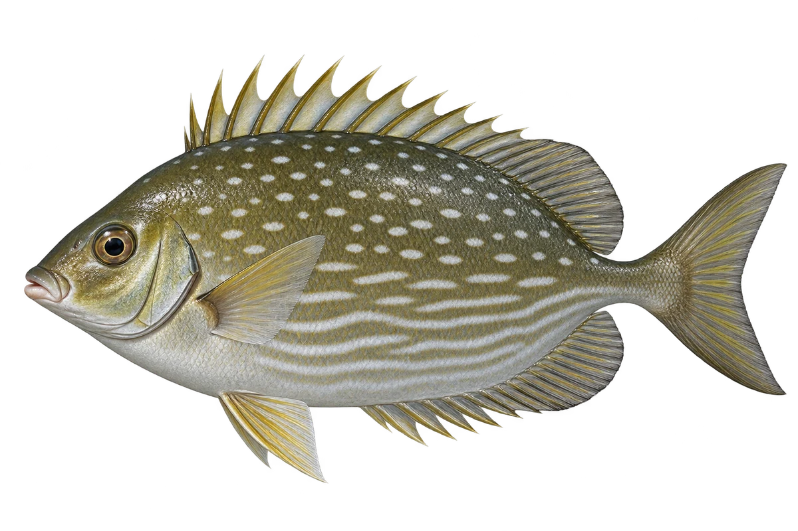

# 条纹篮子鱼

Siganus javus · 鱼 · 2026-10-07

以明确物种代表常用名称；插画是观察示意，不用来野外鉴定。

- **点点和波浪线**：它身体上方有小蓝点，下方有银蓝色波浪线。（VTH-BC-01）
- **小嘴高身体**：它身体高而侧扁，嘴小，鼻子尖尖的。（VTH-BC-02）
- **吃藻类**：它会吃礁石上的藻类和小型水生植物。（VTH-BC-03）

资料：[中央研究院／数位典藏](https://catalog.digitalarchives.tw/item/00/00/3f/8e.html)。位置：Identification / Summary / Biology / Habitat / species account。

[事实表](../claims.json) · [配音脚本](../scripts/audio-v1.json) · [生成提示与原图索引](../../../design/content/v1/generation.json)

每卡一段介绍、三个点听。新卡没有设置未经标定的局部放大坐标。图为 AI 原创艺术示意，非鉴定照片；交付为 2D 插画及图鉴内容，不代表新增三维捕获物种。
