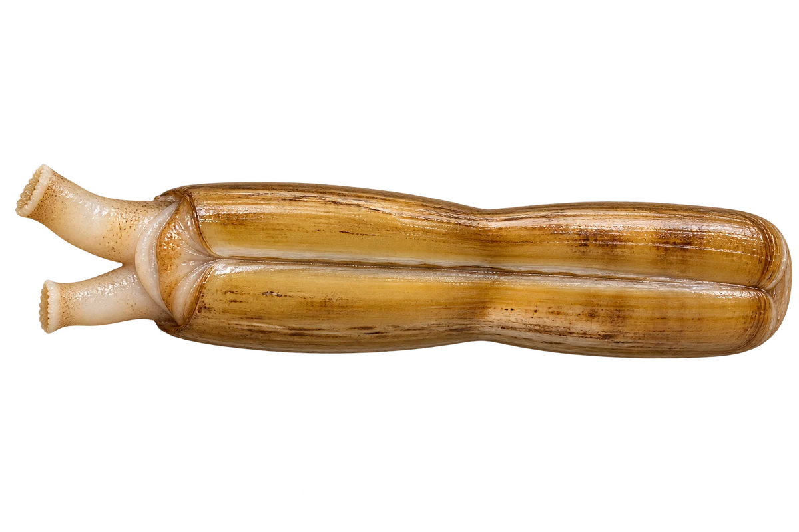

# 缢蛏（蛏子）

Sinonovacula constricta · 双壳贝 · 2026-10-07

中文食材俗名仅作生活联系；本卡以明确学名表示活体，不作为野外采集、鉴定或可食判断。

- **名字叫缢蛏**：这种双壳贝，叫作缢蛏，也叫毛蛏。（VTH-DG-01）
- **泥底的家**：它住在浅海的泥底。（VTH-DG-02）
- **西北太平洋伙伴**：在中国沿海、日本和韩国等地可以见到。（VTH-DG-03）

资料：[台湾政府机构／海洋与渔业资料](https://kmweb.moa.gov.tw/theme_data.php?id=82&theme=fisheasy)。位置：毛蟶 / identity / 棲地分布。

[事实表](../claims.json) · [配音脚本](../scripts/audio-v1.json) · [生成提示与原图索引](../../../design/content/v1/generation.json)

每卡一段介绍、三个点听。新卡没有设置未经标定的局部放大坐标。图为 AI 原创艺术示意，非鉴定照片；交付为 2D 插画及图鉴内容，不代表新增三维捕获物种。
