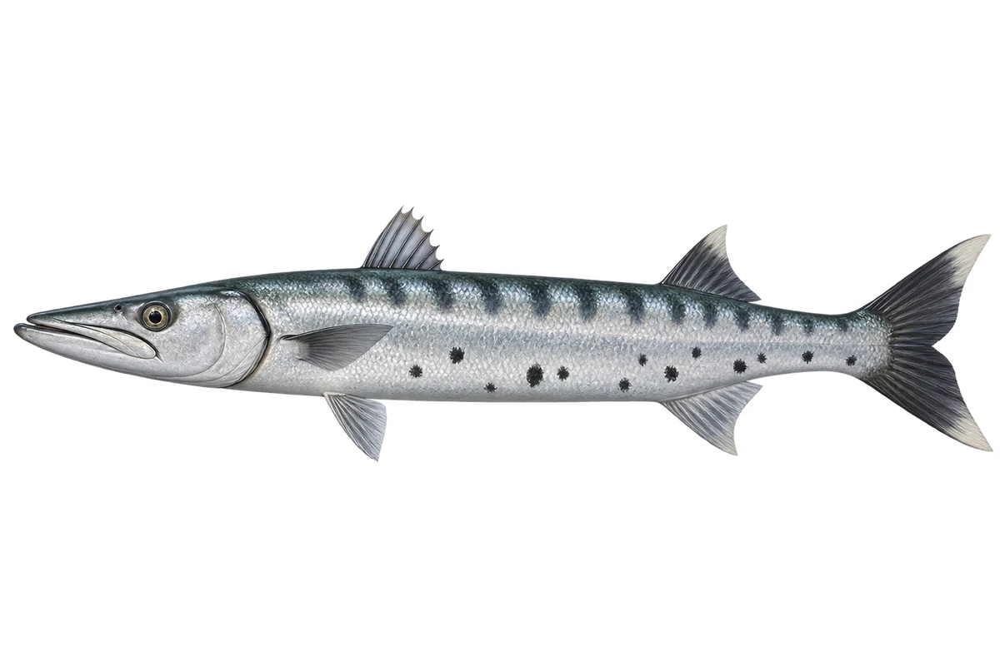

# 海狼 · 大魣 · 内容包 v1

2026-10-06 · Sphyraena barracuda · 主要制作：主代理亲自完成。

## 观察与自由创作

孩子入口：看看海狼，身体好长呀。

把鱼拉成长条，再给两片鳍留一点距离。

| 点听 | 短句 | 事实依据 |
| --- | --- | --- |
| 长长的身体 | 它的身体，细细长长的。 | SB-01 |
| 分开的背鳍 | 背上这两片鳍，隔得很远。 | SB-02 |
| 下边的黑点 | 身体下边，还有一些黑点。 | SB-03 |

不是答题关卡。创作不要求与真实鱼一致；不同嘴、鳍、身体和花纹可以自由组合。

## 亲子解释与证据范围

海狼是多义俗名，本卡限定大魣 S. barracuda。闭口插画强调形状和鳍，不夸张表现牙齿；不是所有魣都画同样黑点。

本页事实引用 [claims.json](../claims.json)：SB-01、SB-02、SB-03。

- [Florida Museum of Natural History：Great Barracuda](https://www.floridamuseum.ufl.edu/discover-fish/species-profiles/great-barracuda/)

中文短名是孩子入口称呼，正式中文名为项目称呼或工作名；以学名明确对象，未统一认证所有地区俗名。艺术图不是照片，也不是精细分类检索图。

## 已制作素材

- [PNG 原始插画](../../../design/content/v1/illustrations/sphyraena-barracuda.png)
- [WebP 透明展示图](../../../public/content/v1/illustrations/sphyraena-barracuda.webp)
- [短介绍音频](../../../public/content/v1/audio/vo-sb-intro.wav)；另有 3 段点听音频，见 [脚本登记](../scripts/audio-v1.json)。
- [互动预览](../../../public/content/v1/index.html) 包含局部编号、重听、停止和亲子来源展开。

成品用于素材评审和接入准备。声音为系统合成试听，正式分发的声音授权单列；鱼的真实泳姿、精细三维结构和原目录全部历史行为仍不因插画完成而自动认证。
