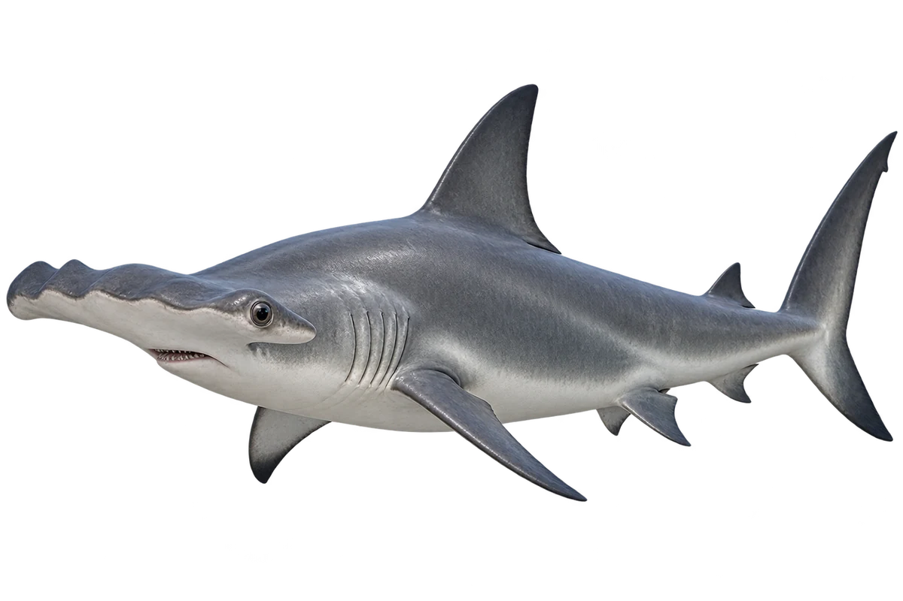

# 路氏双髻鲨（锤头鲨）

Sphyrna lewini · 鱼 · 2026-10-07

以明确物种代表常用名称；插画是观察示意，不用来野外鉴定。

- **锤子一样的头**：它的头向两侧展开，前缘中央有一个凹口。（VTH-BX-01）
- **第一片背鳍较大**：它身体细长，第一片背鳍比第二片大。（VTH-BX-02）
- **暖海里的伙伴**：它生活在温暖海洋，能在近岸和外海活动。（VTH-BX-03）

资料：[Florida Museum](https://www.floridamuseum.ufl.edu/discover-fish/species-profiles/scalloped-hammerhead/)。位置：Identification / Summary / Biology / Habitat / species account。

[事实表](../claims.json) · [配音脚本](../scripts/audio-v1.json) · [生成提示与原图索引](../../../design/content/v1/generation.json)

每卡一段介绍、三个点听。新卡没有设置未经标定的局部放大坐标。图为 AI 原创艺术示意，非鉴定照片；交付为 2D 插画及图鉴内容，不代表新增三维捕获物种。
