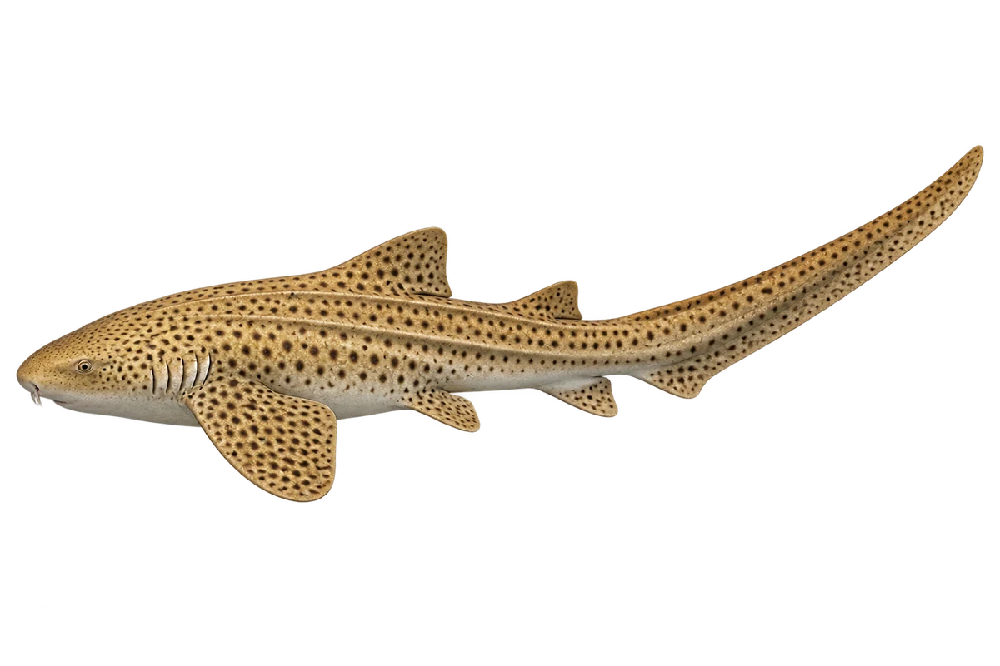

# 豹纹鲨

Stegostoma tigrinum · 鱼 · 2026-10-07

以明确物种代表常用名称；插画是观察示意，不用来野外鉴定。 佛罗里达博物馆旧页面用 Stegostoma fasciatum；新名与旧名映射另记录。

- **斑点长尾巴**：成鱼黄褐色，有深色斑点，尾巴特别长。（VTH-BW-01）
- **小时候是条带**：幼鱼身上有浅色条带，长大才变成斑点。（VTH-BW-02）
- **背上有纵脊**：它背部和体侧，有明显的纵向脊。（VTH-BW-03）

资料：[Florida Museum](https://www.floridamuseum.ufl.edu/discover-fish/species-profiles/stegostoma-fasciatum/)、[WoRMS](https://www.marinespecies.org/aphia.php?id=220032&p=taxdetails)。位置：Identification / Summary / Biology / Habitat / species account。

[事实表](../claims.json) · [配音脚本](../scripts/audio-v1.json) · [生成提示与原图索引](../../../design/content/v1/generation.json)

每卡一段介绍、三个点听。新卡没有设置未经标定的局部放大坐标。图为 AI 原创艺术示意，非鉴定照片；交付为 2D 插画及图鉴内容，不代表新增三维捕获物种。
