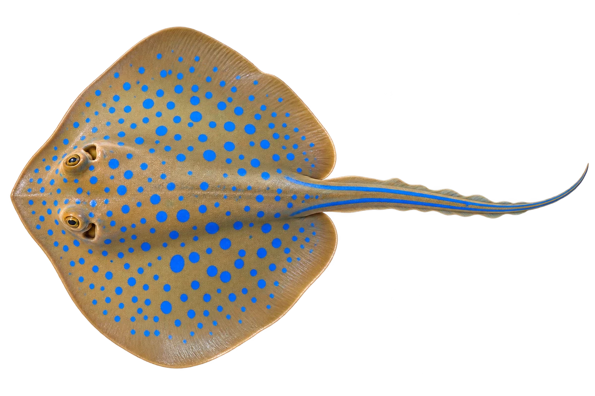

# 蓝点扇尾魟

Taeniura lymma · 鱼 · 2026-10-07

选择背面视角看盘形和蓝点。

- **扁身体蓝点**：它扁扁的身体和腹鳍上，有亮蓝色的小点。（VTH-AT-01）
- **尾巴的蓝线**：它尾巴两边各有一条蓝色线。（VTH-AT-02）
- **涨潮找食物**：涨潮时它会进入浅水，寻找贝类等食物。（VTH-AT-03）

资料：[Australian Museum](https://australian.museum/learn/animals/fishes/bluespotted-fantail-ray-taeniura-lymma-forsskal-1775/)。位置：Identification / Summary / Biology / Habitat / species account。

[事实表](../claims.json) · [配音脚本](../scripts/audio-v1.json) · [生成提示与原图索引](../../../design/content/v1/generation.json)

每卡一段介绍、三个点听。新卡没有设置未经标定的局部放大坐标。图为 AI 原创艺术示意，非鉴定照片；交付为 2D 插画及图鉴内容，不代表新增三维捕获物种。
